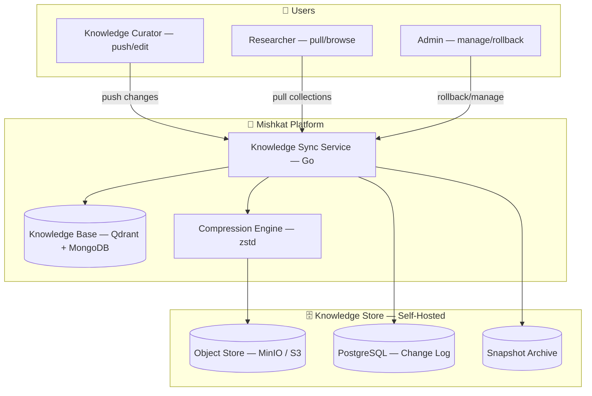
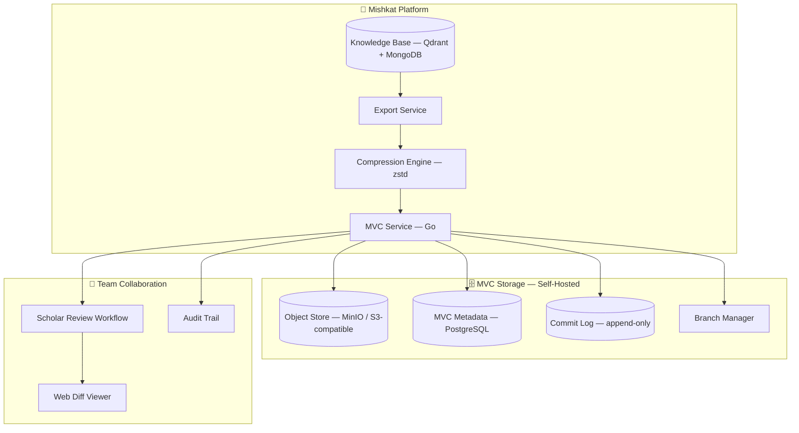
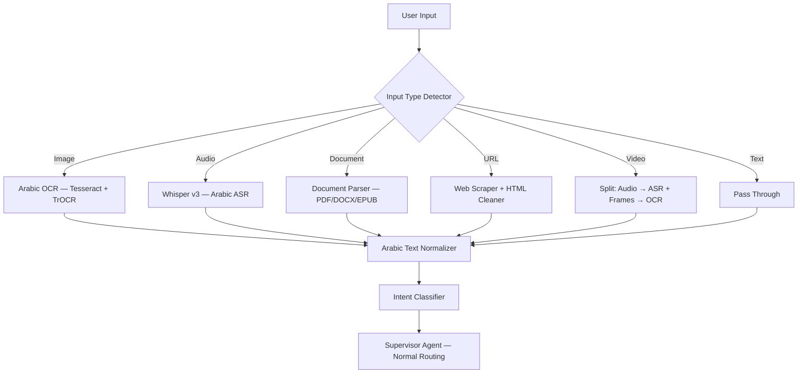

# 🕌 Mishkat Platform — Advanced Features Blueprint
## CLI · Version Control · Knowledge Compression · Mishkat-Hub · Skill Engine · Automation Canvas

> This document extends the core blueprint (Parts 1–3B) with next-generation features.  
> Every feature here is production-designed, deeply described, and directly connected to the existing architecture.

---

## Table of Contents

1. [Mishkat CLI — `msk`](#1-mishkat-cli--msk)
2. [Mishkat Version Control & Compressed Storage (MVC)](#2-mishkat-version-control--compressed-storage-mvc)
3. [Advanced Agent Extensions](#3-advanced-agent-extensions)
4. [Mishkat Skill Engine](#4-mishkat-skill-engine)
5. [Mishkat-Hub — Researcher Mode](#5-mishkat-hub--researcher-mode)
6. [Automation Canvas — Visual n8n-Style Pipeline Builder](#6-automation-canvas--visual-n8n-style-pipeline-builder)
7. [Advanced Mention System (`@`)](#7-advanced-mention-system-)
8. [Smart Notifications & Real-Time Delivery](#8-smart-notifications--real-time-delivery)
9. [Offline-First PWA & Mobile Support](#9-offline-first-pwa--mobile-support)
10. [Updated Repository Structure](#10-updated-repository-structure)
11. [Extended Roadmap (Weeks 25–40)](#11-extended-roadmap-weeks-2540)

---

## 1. Mishkat CLI — `msk`

### Overview

`msk` is a full-featured command-line interface for the Mishkat platform. It gives your university team, researchers, and power users a terminal-native way to interact with the entire platform — querying knowledge, managing the vector database, ingesting sources, exporting research, running agents, and administering the system — all from the command line. This is the **control plane** of Mishkat outside the browser.

### Design Philosophy

- **Unix-philosophy**: Each subcommand does one thing and does it well.
- **Composable**: Pipe `msk` output into other tools — `msk query "..." | jq .sources | fzf`
- **Offline-capable**: Knowledge snapshots can be queried locally without hitting the server.
- **Built in Go**: Ships as a single statically-linked binary. No Python, no Node, no runtime dependencies. Cross-platform (Linux, macOS, Windows).

### Installation

```bash
# Homebrew (macOS / Linux)
brew install mishkat/tap/msk

# Direct download
curl -fsSL https://cli.mishkat.app/install.sh | sh

# Go install
go install github.com/mishkat/cli/cmd/msk@latest

# Docker
docker run --rm mishkat/cli msk --help
```

### Authentication

```bash
msk auth login                          # Opens browser for OAuth, stores JWT in ~/.config/msk/credentials.json
msk auth login --api-key sk-xxxx       # API key auth (for CI/scripts)
msk auth whoami                         # Show current user, role, quota
msk auth logout
msk auth token                          # Print current access token (for piping to curl)
```

### Command Groups

---

#### `msk query` — Ask the Knowledge Base

```bash
# Basic query
msk query "ما حكم صلاة الجمعة للمسافر؟"

# Specify agent
msk query "compare madhabs on zakat" --agent comparative

# Specify references
msk query "فضل الصدقة" --ref bukhari --ref muslim

# Stream output (token by token, like ChatGPT)
msk query "اشرح حديث النية" --stream

# Output as JSON (machine-readable, great for scripting)
msk query "حكم الزواج" --format json | jq '.sources[].hadith_number'

# Save result to file
msk query "باب الصيام" --output research/siyam.md

# Query with context from a file
msk query "is this authentic?" --context ./hadith.txt

# Specify language for output
msk query "نية الصيام" --lang en

# Use local offline snapshot (no network)
msk query "ما فضل الجمعة" --offline

# Show confidence scores and source grading
msk query "طلب العلم فريضة" --verbose
```

**Output example (`--format json`):**
```json
{
  "query": "حكم صيام يوم الشك",
  "agent": "rag",
  "answer": "...",
  "confidence": 0.91,
  "sources": [
    {
      "collection": "bukhari",
      "book": "الصيام",
      "hadith_number": 1906,
      "narrator": "أبو هريرة",
      "grade": "صحيح",
      "text": "..."
    }
  ],
  "latency_ms": 312,
  "cached": false
}
```

---

#### `msk knowledge` — Knowledge Base Management

This is the heart of the CLI — managing the vector store, snapshots, compression, and local caching.

```bash
# ── Snapshot Management ──────────────────────────────────────
msk knowledge snapshot create                    # Create a compressed snapshot of the entire KB
msk knowledge snapshot create --ref bukhari      # Snapshot a single collection
msk knowledge snapshot list                      # List all snapshots with size + date
msk knowledge snapshot download <snapshot-id>   # Download snapshot locally
msk knowledge snapshot restore <snapshot-id>    # Restore from a snapshot
msk knowledge snapshot delete <snapshot-id>

# ── Export & Import ──────────────────────────────────────────
msk knowledge export --ref bukhari --format parquet --out ./bukhari.parquet
msk knowledge export --all --format jsonl.zst --out ./mishkat-kb-$(date +%Y%m%d).jsonl.zst
msk knowledge import ./new-collection.jsonl --ref sunnah_abu_dawud

# ── Statistics ───────────────────────────────────────────────
msk knowledge stats                              # Total vectors, collections, size, last updated
msk knowledge stats --ref bukhari               # Per-collection detail

# ── Search & Browse ──────────────────────────────────────────
msk knowledge search "الرحمة" --top 10         # Direct vector search, no LLM
msk knowledge browse --ref bukhari --book "الإيمان"
msk knowledge get --ref bukhari --number 1     # Fetch hadith by number

# ── Health & Integrity ───────────────────────────────────────
msk knowledge verify                            # Check vector integrity (count vs metadata)
msk knowledge deduplicate --dry-run            # Find and remove duplicate chunks
msk knowledge reindex --ref muslim             # Rebuild index for a collection
```

**Compression & Storage Design:**

The `msk knowledge export` command uses a layered compression strategy:

```
Raw JSONL → Arabic text deduplication → zstd compression → .mishkat.zst package
```

The `.mishkat.zst` package format is a custom archive:

```
mishkat-kb-20260514.mishkat.zst
├── manifest.json          # metadata: collections, version, checksum
├── vectors/
│   ├── bukhari.npy.zst    # Numpy array of vectors, zstd-compressed (60–70% smaller)
│   └── muslim.npy.zst
├── metadata/
│   ├── bukhari.jsonl.zst  # Hadith metadata, one per line, zstd-compressed
│   └── muslim.jsonl.zst
└── schema/
    └── v2.json            # Schema version for forward compatibility
```

| Format | Size (Bukhari) | Notes |
|--------|---------------|-------|
| Raw vectors (float32) | ~58 MB | Qdrant internal |
| `.jsonl` | ~22 MB | Human-readable |
| `.jsonl.zst` | ~4.2 MB | **zstd compression, level 19** |
| `.mishkat.zst` | ~6.1 MB | Vectors + metadata, full package |

---

#### `msk ingest` — Data Ingestion from CLI

```bash
# Ingest a PDF book
msk ingest ./fath-al-bari.pdf --ref fath_al_bari --lang ar

# Ingest a folder of JSON files
msk ingest ./data/tirmidhi/ --ref tirmidhi --format json --watch

# Ingest from URL (scrape + clean + embed)
msk ingest https://islamqa.info/ar/answers/12345 --type fatwa

# Ingest from Shamela DB export
msk ingest ./shamela_export.db --type shamela --ref custom

# Dry-run (validate without storing)
msk ingest ./dataset.jsonl --dry-run --verbose

# Resume interrupted ingestion
msk ingest --resume job_id_abc123

# Watch a directory for new files (daemon mode)
msk ingest ./incoming/ --watch --daemon --ref auto_detect

# Check job status
msk ingest status job_id_abc123
msk ingest jobs --limit 20 --status running
```

---

#### `msk agent` — Run Agents Directly

```bash
# Run a specific agent
msk agent run research "اجمع أحاديث الصبر مع التخريج"
msk agent run verify "إن الله جميل يحب الجمال"
msk agent run translate "صُمْ لِرُؤيَتِهِ" --to en
msk agent run tutor "explain the concept of tawbah for a beginner"
msk agent run compare "ruling on music" --madhabs all

# Run a multi-agent chain
msk agent chain research,verify,translate \
  --query "أحاديث الصيام" \
  --lang en \
  --output ./ramadan_research.md

# List running agents
msk agent status

# View agent execution log
msk agent log <run-id> --follow

# Batch run from file (one query per line)
msk agent batch ./queries.txt --agent rag --output-dir ./results/
```

---

#### `msk vc` — Mishkat Version Control

_(Detailed in Section 2)_

```bash
msk vc commit --message "Add Abu Dawud"   # Commit current KB state
msk vc push                               # Push to remote MVC server
msk vc pull                               # Pull updates from remote
msk vc diff                               # Show what changed since last commit
msk vc log                                # View commit history
msk vc status                             # Show staged/unstaged KB changes
```

---

#### `msk skill` — Skill Management

_(Detailed in Section 4)_

```bash
msk skill list
msk skill install hadith-formatter
msk skill create my-custom-skill
msk skill run hadith-formatter --input ./raw.txt
```

---

#### `msk admin` — System Administration

```bash
# User management
msk admin users list
msk admin users promote <user-id> --role scholar
msk admin users ban <user-id> --reason "abuse"

# System health
msk admin health                         # Full health dashboard in terminal
msk admin metrics --live                 # Live Prometheus metrics in terminal
msk admin logs --service rag-engine --follow

# Cache management
msk admin cache flush                    # Flush all Redis caches
msk admin cache flush --pattern "query:*"
msk admin cache stats                    # Cache hit rate, memory usage

# Queue management
msk admin queue status                   # Kafka/job queue depth
msk admin queue drain embedding          # Process all pending embedding jobs

# Backup
msk admin backup create --full
msk admin backup restore <backup-id>

# Config
msk admin config get llm.primary
msk admin config set llm.primary google-gemini
msk admin config reload                  # Hot-reload config without restart
```

---

#### `msk research` — Research Library Management

```bash
msk research list                        # List saved research
msk research get <research-id>
msk research export <research-id> --format pdf
msk research export --all --format markdown --out ./library/
msk research share <research-id> --public
msk research delete <research-id>
msk research search "زكاة الفطر"
```

---

#### `msk hub` — Mishkat-Hub Access from CLI

```bash
msk hub publish ./my-research.md --title "أحاديث الصيام" --tags fiqh,siyam
msk hub search "hadith isnad"
msk hub follow researcher <user-id>
msk hub trending --period week
```

---

### CLI Configuration File

```yaml
# ~/.config/msk/config.yml

server:
  url: https://api.mishkat.app
  timeout: 120s

auth:
  method: jwt                         # jwt | api-key
  # api_key: sk-xxxx                 # if method = api-key

defaults:
  agent: auto
  language: ar
  format: text                        # text | json | markdown
  references:
    - bukhari
    - muslim

output:
  color: true
  stream: true                        # Default to streaming
  pager: true                         # Use $PAGER for long output

offline:
  enabled: false
  snapshot_dir: ~/.msk/snapshots/
  auto_sync: weekly

cache:
  enabled: true
  dir: ~/.msk/cache/
  ttl: 24h
```

---

### Shell Integration

```bash
# Bash/Zsh completion
msk completion bash >> ~/.bashrc
msk completion zsh >> ~/.zshrc

# Fish completion
msk completion fish > ~/.config/fish/completions/msk.fish

# Aliases (add to ~/.bashrc)
alias mq='msk query --stream'
alias mi='msk ingest'
alias mks='msk knowledge stats'
```

---

### CLI Architecture (Go)

```
cli/
├── cmd/
│   └── msk/
│       └── main.go                  # Entry point
├── internal/
│   ├── commands/
│   │   ├── root.go                  # cobra root command
│   │   ├── query.go                 # msk query
│   │   ├── knowledge.go             # msk knowledge
│   │   ├── ingest.go                # msk ingest
│   │   ├── agent.go                 # msk agent
│   │   ├── vc.go                    # msk vc
│   │   ├── skill.go                 # msk skill
│   │   ├── admin.go                 # msk admin
│   │   ├── research.go              # msk research
│   │   ├── hub.go                   # msk hub
│   │   └── auth.go                  # msk auth
│   ├── client/
│   │   ├── api_client.go            # HTTP client to Mishkat API
│   │   ├── sse_reader.go            # SSE stream consumer
│   │   └── retry.go
│   ├── offline/
│   │   ├── snapshot_manager.go      # Download/load local snapshots
│   │   ├── local_search.go          # ONNX embedding + local search
│   │   └── cache.go                 # Local response cache
│   ├── compression/
│   │   ├── mishkat_archive.go       # .mishkat.zst packer/unpacker
│   │   ├── vector_compress.go       # numpy float32 + zstd
│   │   └── metadata_compress.go     # JSONL + zstd
│   ├── output/
│   │   ├── formatter.go             # text / json / markdown output
│   │   ├── table.go                 # terminal table rendering
│   │   └── progress.go              # progress bars (charmbracelet/bubbletea)
│   └── config/
│       ├── config.go                # Viper config loader
│       └── credentials.go           # Secure credential storage
├── go.mod
└── Makefile
```

**Key dependencies:**

| Package | Purpose |
|---------|---------|
| `github.com/spf13/cobra` | CLI framework |
| `github.com/spf13/viper` | Config management |
| `github.com/charmbracelet/bubbletea` | TUI for interactive modes |
| `github.com/charmbracelet/lipgloss` | Terminal styling |
| `github.com/klauspost/compress/zstd` | zstd compression |
| `github.com/schollz/progressbar/v3` | Progress bars |
| `github.com/99designs/keyring` | Secure credential storage |

---

## 2. Mishkat Knowledge Sync & Compressed Storage (MKS)

### Overview

**MKS (Mishkat Knowledge Sync)** is a self-hosted knowledge distribution and synchronization system built specifically for Islamic knowledge bases. It lets your university team **pull** hadith collections, tafsir, and scholarly books from a central server, **push** new or corrected content back, and **edit parts of existing collections incrementally** — without re-uploading everything from scratch.

Think of it like an app store for Islamic knowledge packages — you browse what's available, pull what you need, make corrections or additions, and push your changes back. Only the changed parts are transferred, compressed with zstd for minimal storage and bandwidth.

**MKS is NOT a code version control system.** There are no branches, no merge conflicts, no pull requests. It's designed for **knowledge curators** — scholars who add books, fix grading errors, update translations — not software developers.

### What MKS Does

| Feature | Description |
|---------|-------------|
| **Pull** | Download hadith collections, tafsir, sharh, or any knowledge package from the server |
| **Push** | Upload new content or corrections back to the server |
| **Incremental Edit** | Change specific hadiths, grades, or metadata without re-uploading the whole collection |
| **Delta Sync** | Only transfer what changed — not the entire collection (like rsync for knowledge) |
| **Compression** | All packages compressed with zstd — 4× to 6× smaller than raw data |
| **Snapshots** | Versioned snapshots of the entire KB — rollback to any previous state |
| **History** | Full change log — who changed what, when, and why |
| **Rollback** | Undo any change or restore a collection to a previous version |
| **Multi-Instance Sync** | Sync knowledge between multiple Mishkat installations (university ↔ backup, university ↔ university) |
| **Offline Export** | Export any collection as a compressed package for offline use |

### What MKS Does NOT Do

| ❌ Not Included | Why |
|----------------|-----|
| Branches | Knowledge doesn't need feature branches — it's not code |
| Merge conflicts | Changes are at the hadith level, not line level — conflicts are rare and auto-resolved |
| Pull requests / code review | Scholar approval happens through the platform's review system, not VCS |
| File-level diffs | Knowledge is structured (hadith = unit), not free-form files |
| CI/CD integration | This is a knowledge store, not a code repository |

---

### Architecture



---

### Knowledge Packages

The unit of work in MKS is a **Knowledge Package** — a compressed bundle containing a collection's data, metadata, and vectors:

```
📦 bukhari.mks (Knowledge Package)
├── manifest.json              # Collection info: name, version, hadith count, checksum
├── hadiths/
│   ├── 01-الإيمان.jsonl.zst   # Hadiths per book, compressed
│   ├── 02-العلم.jsonl.zst
│   └── ...
├── vectors/
│   ├── 01-الإيمان.npy.zst     # Embedding vectors, compressed
│   └── ...
├── metadata/
│   ├── narrators.jsonl.zst    # Narrator info for this collection
│   └── grading.jsonl.zst      # Grading data
└── changelog.json              # History of changes to this package
```

**Available Knowledge Packages:**

| Package | Type | Contents | Compressed Size |
|---------|------|----------|----------------|
| `bukhari.mks` | Hadith Collection | 7,563 hadiths + vectors + metadata | ~6 MB |
| `muslim.mks` | Hadith Collection | 7,563 hadiths | ~5.5 MB |
| `abu_dawud.mks` | Hadith Collection | 5,274 hadiths | ~4.2 MB |
| `tirmidhi.mks` | Hadith Collection | 3,956 hadiths | ~3.8 MB |
| `nasai.mks` | Hadith Collection | 5,761 hadiths | ~4.5 MB |
| `ibn_majah.mks` | Hadith Collection | 4,341 hadiths | ~3.5 MB |
| `tafsir_ibn_kathir.mks` | Tafsir | Full tafsir | ~18 MB |
| `tafsir_tabari.mks` | Tafsir | Full tafsir | ~25 MB |
| `fath_al_bari.mks` | Sharh | Commentary on Bukhari | ~22 MB |
| `riyadh_al_salihin.mks` | Compiled | 1,896 hadiths | ~2.1 MB |
| `narrator_database.mks` | Rijal | 12,000+ narrator profiles | ~8 MB |

---

### `msk sync` Commands

#### Pull — Download Knowledge

```bash
# Browse available packages
msk sync list                                    # List all available packages on server
msk sync list --type hadith                     # Filter by type (hadith, tafsir, sharh, rijal)
msk sync info bukhari                           # Show package details (size, version, hadith count)

# Pull a collection
msk sync pull bukhari                           # Download Sahih al-Bukhari
msk sync pull bukhari muslim tirmidhi           # Pull multiple at once
msk sync pull --all                             # Pull everything available
msk sync pull tafsir_ibn_kathir                 # Pull a tafsir

# Pull with options
msk sync pull bukhari --offline                 # Download for offline use (includes vectors)
msk sync pull bukhari --text-only               # Text + metadata only (no vectors, smaller)
msk sync pull bukhari --lang ar,en              # Only Arabic + English translations
```

#### Push — Upload New or Updated Knowledge

```bash
# Push a new collection
msk sync push ./nasai_data/ --name nasai --type hadith --message "Sunan al-Nasa'i — 5,761 hadiths"

# Push from a structured JSON file
msk sync push ./tirmidhi.json --name tirmidhi --type hadith

# Push a tafsir
msk sync push ./tafsir_tabari/ --name tafsir_tabari --type tafsir --message "Tafsir al-Tabari — full"

# Dry run (validate without uploading)
msk sync push ./data/ --name test --dry-run --verbose
```

#### Edit — Incremental Changes (No Full Re-Upload)

This is the key feature — **edit specific hadiths without re-uploading the whole collection:**

```bash
# Fix a grading error on a specific hadith
msk sync edit bukhari --hadith 1906 --field grade --value "صحيح" --message "Fix grading per Ibn Hajar"

# Update a narrator's reliability rating
msk sync edit narrator_database --narrator "حفص بن سليمان" --field grade --value "متروك"

# Add a missing translation
msk sync edit bukhari --hadith 1 --field translation_en --value "Actions are by intentions..." --message "Add English translation"

# Edit multiple hadiths from a patch file
msk sync edit bukhari --patch ./corrections.jsonl --message "Batch corrections from Dr. Yusuf"

# Edit metadata (author, description, etc.)
msk sync edit bukhari --metadata --field description --value "Updated description"
```

**How Incremental Edit Works:**
```
1. User runs: msk sync edit bukhari --hadith 1906 --field grade --value "صحيح"
2. MKS creates a DELTA record:
   {
     "collection": "bukhari",
     "hadith": 1906,
     "field": "grade",
     "old_value": "حسن",
     "new_value": "صحيح",
     "author": "dr-yusuf",
     "message": "Fix grading per Ibn Hajar",
     "timestamp": "2026-05-14T10:00:00Z"
   }
3. Delta is pushed to the server (few bytes, not the whole collection)
4. Server applies delta to the live collection
5. Other users who pull bukhari next time get the updated version
6. If someone already has bukhari locally, `msk sync update` applies only the deltas
```

#### Update — Get Latest Changes

```bash
# Update all local packages to latest version
msk sync update                                 # Downloads only deltas, not full packages

# Update a specific collection
msk sync update bukhari                         # Get latest changes for Bukhari

# Check what changed
msk sync changes bukhari                        # Show list of changes since your last pull
msk sync changes --since 2026-05-01            # Changes since a date
```

#### Snapshots & Rollback

```bash
# Create a snapshot of the current KB state
msk sync snapshot create --message "Before adding Nasa'i"

# List snapshots
msk sync snapshot list
# Output:
# ID          Date              Size     Message
# snap_001    2026-05-01        560 MB   Initial Kutub al-Sittah
# snap_002    2026-05-10        580 MB   Before adding Nasa'i
# snap_003    2026-05-14        610 MB   After grading corrections

# Rollback to a previous snapshot
msk sync rollback snap_002 --confirm

# Rollback a single collection to a previous state
msk sync rollback snap_001 --collection bukhari

# Export a snapshot as a downloadable archive
msk sync snapshot export snap_003 --out ./mishkat-backup-20260514.mks.zst
```

#### History — Change Log

```bash
# View change log for a collection
msk sync log bukhari
# Output:
# 2026-05-14 10:00  dr-yusuf     edit    hadith:1906 grade "حسن" → "صحيح"
# 2026-05-13 14:22  admin        push    Added 342 hadiths from Shamela export
# 2026-05-10 09:15  dr-fatima    edit    hadith:42 translation_en updated
# 2026-05-01 00:00  admin        push    Initial import — 7,563 hadiths

# View log for all collections
msk sync log --all --limit 50

# View a specific change
msk sync log bukhari --change chg_abc123
```

---

### Compression & Storage

MKS uses layered zstd compression for minimal storage and fast transfers:

| Data Type | Raw Size | Compressed | Ratio |
|-----------|----------|-----------|-------|
| Hadith text (Arabic JSONL) | 22 MB | 3.7 MB | 6:1 |
| Embedding vectors (float32) | 58 MB | 26 MB | 2.2:1 |
| Narrator metadata | 8 MB | 1.6 MB | 5:1 |
| Full Kutub al-Sittah + metadata + vectors | ~2.1 GB | ~560 MB | 3.8:1 |

**Delta transfers** make updates even smaller:
- Editing one hadith's grade = ~200 bytes transferred
- Adding 100 new hadiths = ~50 KB transferred (vs re-downloading 6 MB)
- Typical daily sync = under 1 MB

---

### Multi-Instance Sync

Sync knowledge between multiple Mishkat installations:

```bash
# Register another Mishkat instance
msk sync remote add backup https://mishkat-backup.youruni.edu

# Push all knowledge to the backup
msk sync push --remote backup --all

# Pull from another university's Mishkat
msk sync remote add madinah https://mishkat.iu-madinah.edu
msk sync pull --remote madinah tafsir_ibn_kathir

# Auto-sync (runs as a background service)
msk sync auto --interval 6h --remote backup
```

---

### MKS Web UI

Accessible at `mishkat.app/sync` — a simple dashboard for managing knowledge packages:

```
┌──────────────────────────────────────────────────────────────────┐
│  📦 Knowledge Sync                                [Sync Now]     │
├──────────────────────────────────────────────────────────────────┤
│  PACKAGES                        │  DETAILS                      │
│                                  │                               │
│  ☑ صحيح البخاري     v3.2  6MB   │  Package: صحيح البخاري        │
│  ☑ صحيح مسلم        v2.1  5MB   │  Version: 3.2                 │
│  ☐ سنن أبي داود     v1.0  4MB   │  Hadiths: 7,563               │
│  ☐ جامع الترمذي     v1.0  4MB   │  Last Updated: May 14, 2026   │
│  ☐ تفسير ابن كثير   v1.5  18MB  │  Size: 6.1 MB (compressed)    │
│                                  │  Changes since your version:  │
│  [Pull Selected] [Push New]      │    • 3 grading corrections    │
│                                  │    • 12 translations added    │
│  RECENT CHANGES                  │                               │
│  dr-yusuf — fixed grade #1906   │  [Update] [View Changes]      │
│  admin — added Nasa'i            │                               │
└──────────────────────────────────────────────────────────────────┘
```

---

### MKS Service Architecture

```
sync-service/                              # Go
├── cmd/main.go
├── internal/
│   ├── core/
│   │   ├── package.go                    # Knowledge package model
│   │   ├── delta.go                      # Incremental change model
│   │   ├── snapshot.go                   # Full KB snapshot model
│   │   └── changelog.go                  # Change log / history
│   ├── storage/
│   │   ├── object_store.go              # MinIO / S3 — stores .mks packages
│   │   ├── meta_repo.go                 # PostgreSQL — change log, package registry
│   │   └── delta_store.go               # Stores incremental deltas
│   ├── compress/
│   │   ├── jsonl_zstd.go               # JSONL + zstd compression
│   │   ├── numpy_zstd.go               # Vector compression
│   │   └── package_builder.go           # Builds .mks packages
│   ├── sync/
│   │   ├── pull_service.go              # Handle pull requests from clients
│   │   ├── push_service.go              # Handle push from curators
│   │   ├── delta_sync.go                # Apply incremental edits
│   │   ├── remote_sync.go               # Sync between Mishkat instances
│   │   └── auto_sync.go                 # Background auto-sync daemon
│   ├── validation/
│   │   ├── schema_validator.go          # Validate pushed data against schema
│   │   ├── arabic_validator.go          # Check Arabic text integrity
│   │   └── vector_validator.go          # Verify vector dimensions match model
│   └── api/
│       ├── package_api.go               # List, info, pull, push endpoints
│       ├── edit_api.go                  # Incremental edit endpoints
│       ├── snapshot_api.go              # Snapshot create/restore/export
│       └── changelog_api.go             # Change history endpoints
├── go.mod
└── Dockerfile
```

---

## 3. Advanced Agent Extensions

---

### Architecture



---

### Core Concepts

MVC borrows familiar Git concepts but redefines them for knowledge bases:

| Git Concept | MVC Equivalent | Description |
|-------------|---------------|-------------|
| Repository | **Knowledge Repository** | One repo per Mishkat installation |
| Commit | **Knowledge Commit** | Snapshot of KB changes with message, author, timestamp |
| Branch | **KB Branch** | Independent line of development (e.g., `feature/add-abu-dawud`) |
| Diff | **Knowledge Diff** | Arabic-aware, hadith-level change detection |
| Tag | **KB Release** | Stable, versioned snapshot (e.g., `v2.3.0`) |
| Pull Request | **Scholar Review Request** | Changes reviewed and approved by a scholar before merge |
| Remote | **MVC Remote** | Another Mishkat server (for university-to-university sync) |
| Clone | **KB Clone** | Download a full local copy for offline use |

---

### `msk vc` Commands — Full Reference

#### Basic Workflow

```bash
# Initialize MVC in a new Mishkat instance
msk vc init --remote https://vc.mishkat.youruni.edu

# Check current status
msk vc status                                     # Show changed collections since last commit

# Stage specific changes
msk vc stage --ref bukhari                        # Stage all changes in bukhari collection
msk vc stage --ref muslim --book "الصيام"        # Stage a specific book
msk vc stage --all                               # Stage everything

# Commit staged changes
msk vc commit --message "Add Sunan Abu Dawud — 5,274 hadiths"
msk vc commit --message "Fix grading errors in Tirmidhi" --author dr-yusuf

# Push to remote MVC server
msk vc push
msk vc push --remote https://vc.mishkat.backup.edu  # Push to secondary remote

# Pull from remote
msk vc pull
msk vc pull --ref bukhari                        # Pull only a specific collection

# View history
msk vc log                                       # Full commit history
msk vc log --ref muslim --limit 20              # Collection-specific history
msk vc log --author dr-yusuf                    # Commits by a specific scholar
msk vc log --since 2026-01-01                   # Date-filtered history
```

#### Diffing & Comparison

```bash
# Show changes since last commit
msk vc diff                                      # All collections
msk vc diff --ref bukhari                        # Single collection
msk vc diff --ref bukhari --book "الإيمان"      # Single book
msk vc diff commit_a..commit_b                  # Between two commits

# Arabic-aware diff output:
# ─────────────────────────────────────────────
# Collection: bukhari / Book: الصيام / Hadith: 1906
# ─────────────────────────────────────────────
# - grade: "حسن"
# + grade: "صحيح"
# + grade_source: "ابن حجر العسقلاني"
#   narrator: أبو هريرة
#   matn: ...
# ─────────────────────────────────────────────
```

#### Branching

```bash
# Create and switch to a new branch
msk vc branch create feature/add-nasai
msk vc branch switch feature/add-nasai

# List branches
msk vc branch list

# Merge a branch (triggers Scholar Review Request if branch is protected)
msk vc branch merge feature/add-nasai --into main

# Delete after merge
msk vc branch delete feature/add-nasai

# Protected branches (require scholar approval before merge)
msk vc branch protect main --reviewers dr-yusuf,sheikh-omar
```

#### Scholar Review Requests (SRR)

```bash
# Create a review request (like a pull request)
msk vc review create \
  --from feature/add-nasai \
  --into main \
  --title "Add: Sunan al-Nasa'i — 5,761 hadiths" \
  --description "Sourced from Shamela export, cleaned and validated" \
  --reviewers dr-yusuf,sheikh-omar,dr-fatima

# List open reviews
msk vc review list --status open

# View a review (shows diff + comments)
msk vc review show <review-id>

# Add a comment to a specific hadith change in a review
msk vc review comment <review-id> \
  --ref nasai --hadith 1234 \
  --text "يجب التحقق من هذا السند — ابن حجر ذكره في التقريب"

# Approve and merge
msk vc review approve <review-id>
msk vc review merge <review-id>

# Request changes
msk vc review request-changes <review-id> \
  --text "يرجى مراجعة أحاديث باب الصيام قبل الدمج"
```

#### Releases & Tags

```bash
# Tag a stable KB version (like semantic versioning for your knowledge base)
msk vc tag create v2.3.0 \
  --message "Completes Kutub al-Sittah — 50,000+ hadiths" \
  --sign                                        # Sign with scholar's key

# List releases
msk vc tag list

# Download a specific release as a compressed package
msk vc tag download v2.1.0 --out ./kb-v2.1.0/

# Mark a release as the stable production version
msk vc tag promote v2.3.0 --env production
```

#### Revert & Recovery

```bash
# Revert the last commit
msk vc revert HEAD

# Revert a specific commit
msk vc revert <commit-id>

# Revert only one collection to a previous state
msk vc revert <commit-id> --ref tirmidhi

# View a previous version without reverting
msk vc checkout <commit-id> --ref bukhari --read-only
```

---

### MVC Storage Architecture

All knowledge is stored in a self-hosted, S3-compatible object store (MinIO by default):

```
mvc-object-store/
├── commits/
│   ├── abc123.commit.json        # Commit metadata: message, author, timestamp, parent, tree hash
│   └── def456.commit.json
├── trees/
│   └── tree_hash.json            # Maps collection → blob hash
├── blobs/
│   ├── bukhari/
│   │   ├── 01-الإيمان.jsonl.zst  # Compressed hadith metadata (one per book)
│   │   ├── 01-الإيمان.npy.zst    # Compressed vectors for this book
│   │   └── metadata.json
│   ├── muslim/
│   └── ...
├── refs/
│   ├── heads/
│   │   ├── main                  # Points to latest commit hash on main
│   │   └── feature-add-nasai
│   └── tags/
│       ├── v2.2.0
│       └── v2.3.0
└── index/
    └── current.json              # Current working tree state
```

**Key design decisions:**

- **Content-addressed storage**: blobs are stored by hash (SHA-256), so identical content is never stored twice
- **Vectors stored separately from text**: `.npy.zst` files are binary, `.jsonl.zst` files are Arabic-text-diff-friendly
- **Atomic commits**: a commit is only finalized when all blobs are uploaded and the commit record is written
- **MinIO as default**: runs on your own server, fully S3-compatible so you can swap to any S3-compatible storage (Ceph, Wasabi, etc.)

---

### Compression & Storage

The same layered compression from the original plan, now serving the MVC blob store:

| Data Type | Format | Compression | Ratio |
|-----------|--------|------------|-------|
| Hadith metadata | JSONL → zstd | Level 19 | 5:1 |
| Arabic text | UTF-8 JSONL → zstd | Level 19 | 6:1 |
| Vectors (float32) | NumPy → zstd | Level 9 | 2.2:1 |
| Full KB package | `.mishkat.zst` | Mixed | 3.8:1 average |
| Research docs | Markdown → zstd | Level 15 | 4:1 |

**Full KB size estimate (Kutub al-Sittah + metadata + vectors):**

| Raw | After MVC compression |
|-----|----------------------|
| ~2.1 GB | ~560 MB |

---

### MVC Web UI

Accessible at `mishkat.app/vc` — a browser-based interface for the version control system:

```
┌──────────────────────────────────────────────────────────────────┐
│  🕌 Mishkat VC                          Branch: main ▼  [+ New]  │
├──────────────────────────────────────────────────────────────────┤
│  COMMITS                      │  DIFF VIEWER                     │
│                               │                                  │
│  ● v2.3.0 [tag]               │  Commit: abc123f                 │
│    dr-yusuf • 2026-05-14      │  "Add Sunan Abu Dawud"           │
│    "Add Sunan Abu Dawud"      │                                  │
│                               │  ► bukhari/       0 changes      │
│  ● def456                     │  ► muslim/        0 changes      │
│    dr-fatima • 2026-05-10     │  ▼ abu_dawud/     5,274 added ✅  │
│    "Fix isnad errors"         │    ├─ 01-الطهارة  +342 hadiths   │
│                               │    ├─ 02-الصلاة   +611 hadiths   │
│  ● bcd789                     │    └─ ...                        │
│    admin • 2026-05-01         │                                  │
│    "Initial Bukhari import"   │  [View Full Diff] [Download]     │
│                               │                                  │
│  [Load more…]                 │                                  │
└──────────────────────────────────────────────────────────────────┘
```

---

### MVC Service Architecture

```
mvc-service/                             # New microservice — Go
├── cmd/main.go
├── internal/
│   ├── core/
│   │   ├── commit.go                    # Commit model + hashing
│   │   ├── tree.go                      # Tree (collection snapshot) model
│   │   ├── blob.go                      # Blob (book-level compressed data) model
│   │   ├── ref.go                       # Branch + tag pointer management
│   │   └── diff.go                      # Arabic-aware hadith diff engine
│   ├── storage/
│   │   ├── object_store.go              # MinIO / S3-compatible client
│   │   ├── meta_repo.go                 # PostgreSQL — commits, refs, reviews
│   │   └── index.go                     # Working tree index management
│   ├── compress/
│   │   ├── jsonl_zstd.go               # JSONL + zstd codec
│   │   ├── numpy_zstd.go               # NumPy float32 + zstd codec
│   │   └── package.go                   # .mishkat.zst packer/unpacker
│   ├── review/
│   │   ├── review.go                    # Scholar Review Request model
│   │   ├── review_service.go            # Approval workflow
│   │   └── notify.go                    # Notify reviewers via platform notifications
│   ├── sync/
│   │   ├── remote_sync.go               # Push/pull between MVC remotes
│   │   └── conflict_resolver.go         # Merge conflict detection + resolution
│   └── api/
│       ├── commit_api.go
│       ├── diff_api.go
│       ├── review_api.go
│       └── release_api.go
├── go.mod
└── Dockerfile
```

---

### Real-Time Sync via Server-Sent Events (SSE)

The MVC system uses **SSE (Server-Sent Events)** — not WebSockets — for real-time updates in the web UI and CLI. This is the right tool for this use case:

- **SSE is unidirectional** (server → client): perfect for "push a commit, get a notification"
- **WebSockets are bidirectional** (server ↔ client): needed for live chat, collaborative editing (which uses Yjs elsewhere in the platform)
- SSE works over standard HTTP/2, no special infrastructure needed

```
# Events emitted over SSE:
vc.commit.created      — A new commit was pushed
vc.review.created      — A new Scholar Review Request was opened
vc.review.commented    — A comment was added to a review
vc.review.approved     — A review was approved
vc.review.merged       — A review was merged to a branch
vc.tag.created         — A new KB release was tagged
vc.sync.started        — A remote sync operation began
vc.sync.completed      — Remote sync finished
```

The CLI subscribes via `msk vc watch` and the web UI subscribes via `EventSource`:

```bash
# CLI: Watch for live VC events
msk vc watch                              # Stream all events
msk vc watch --event vc.review.created   # Filter to specific events
```

---

### Multi-Instance Sync (University Networks)

MVC supports syncing between multiple Mishkat installations — for example, if your university has a primary server and a backup, or two universities want to share a knowledge base:

```bash
# Register a remote
msk vc remote add backup https://vc.mishkat-backup.youruni.edu

# List remotes
msk vc remote list

# Push to all remotes
msk vc push --all

# Fetch from a specific remote (without applying)
msk vc fetch backup

# View diff between local and remote
msk vc diff HEAD..backup/main
```

---

### Automatic Knowledge Validation Pipeline

When a commit is pushed, the MVC service automatically runs validation checks before finalizing:

```yaml
# mvc-service internal validation pipeline (runs on every commit)

on_commit:
  - step: schema_validate
    desc: Validate all changed hadiths against hadith_v2.json schema
    on_fail: reject_commit

  - step: encoding_check
    desc: Verify Arabic Unicode normalization (NFC) is consistent
    on_fail: reject_commit

  - step: duplicate_check
    desc: Detect duplicate hadiths across collections (by text similarity)
    on_fail: warn_author

  - step: grade_consistency
    desc: Cross-check grading against known scholarly sources
    on_fail: warn_author

  - step: isnad_check
    desc: Verify narrator names exist in narrator registry
    on_fail: warn_author

  - step: vector_integrity
    desc: Ensure vector dimension matches configured embedding model
    on_fail: reject_commit
```

---

## 3. Advanced Agent Extensions

### 3.1 Citation Network Agent

**Purpose:** Build and traverse a knowledge graph of hadith citations, cross-references, and scholarly commentary — like academic citation tracking but for Islamic texts.

**What it does:**
- Finds all hadiths that cite or are cited by a given hadith
- Traces how a topic evolved across hadith collections
- Identifies scholarly chains — who quoted whom, when, and in what context
- Generates citation maps exportable as DOT/GraphML for Gephi or D3.js

```bash
msk agent run citation-network "حديث النية" --depth 3 --export graph.dot
```

**New tools added:**
- `build_citation_graph(hadith_id, depth)` → citation network JSON
- `find_all_routes(narrator_a, narrator_b)` → path between narrators
- `export_graph(graph, format)` → DOT, GraphML, JSON-LD

---

### 3.2 Fatwa Generation Agent (Scholar-Supervised)

**Purpose:** Draft preliminary fatwa responses by aggregating evidence from all madhabs, hadith collections, and Quranic references. Always marked as "draft for scholar review" — never issued autonomously.

**Workflow:**
1. User submits a fiqh question
2. Agent collects all relevant hadiths + Quran + tafsir
3. Comparative Agent provides madhab positions
4. Verification Agent grades all evidence
5. Draft fatwa assembled with full evidence trail
6. Queued to Scholar Review Panel for human approval
7. Approved fatwa published to Mishkat-Hub

**Output format:**
```
📋 DRAFT FATWA — Awaiting Scholar Review
Topic: حكم بيع المرابحة للآمر بالشراء
Date: 14 Dhul-Qa'dah 1447

الدليل من القرآن:
  ↳ البقرة 2:275 — وَأَحَلَّ اللَّهُ الْبَيْعَ وَحَرَّمَ الرِّبَا [صحيح التفسير]

الدليل من السنة:
  ↳ البخاري 2083 — [صحيح] الراوي: عبد الله بن عمر
  ↳ مسلم 1531 — [صحيح] الراوي: جابر

مواقف المذاهب:
  الحنفية: جائز بشروط ✅  |  المالكية: جائز ✅
  الشافعية: جائز ✅         |  الحنابلة: جائز بشروط ✅

مستوى الثقة: 0.87 🟢
⚠️ هذا المسودة تحتاج مراجعة عالم قبل النشر
```

---

### 3.3 Debate Agent

**Purpose:** Present the strongest arguments for both sides of a scholarly disagreement, structured like a formal munazara (Islamic academic debate).

```bash
msk agent run debate "هل قراءة الفاتحة واجبة خلف الإمام؟" --format munazara
```

**Output structure:**
- **Position A** (mandatory) — strongest arguments + evidence + scholars who hold it
- **Position B** (not mandatory) — strongest arguments + evidence + scholars who hold it
- **Points of Agreement** — where all scholars converge
- **Tarjih** (weighing) — which position has stronger isnad-based evidence
- **Recommended Action** — practical guidance for the questioner

---

### 3.4 Data Lineage Agent

**Purpose:** Track the complete journey of any piece of knowledge in the system — from raw source file to final vector in Qdrant. Answers questions like "where did this chunk come from?" and "who approved this ingestion?"

```bash
msk agent run lineage --chunk-id ch_abc123
```

**Returns:**
```
📦 Data Lineage for chunk ch_abc123
├── Source: ./shamela_export_bukhari.db (uploaded 2026-04-01 by admin@mishkat.app)
├── Parser: ShamelaDbReader v2.1
├── Extraction: MetadataExtractor → IsnadExtractor → MatnExtractor
├── Cleaning: ArabicNormalizer (removed 3 inconsistencies)
├── Chunking: RecursiveCharacterTextSplitter (500 chars, 80 overlap)
├── Embedding: BGE-M3 v1.5, 1024 dims (2026-04-01T14:22:11Z)
├── Stored in: Qdrant collection "bukhari_vectors", point_id: 91247
├── Approved by: dr-yusuf@mishkat.app (2026-04-01T16:00:00Z)
└── Last verified: 2026-05-01 (integrity check passed)
```

---

## 4. Mishkat Skill Engine

### Overview

Skills are reusable, composable processing units — like npm packages but for Islamic knowledge workflows. A skill is a named, versioned pipeline that takes input (text, files, queries) and produces structured output. Skills can be chained, shared, installed from a registry, and even published by community members.

### Skill Anatomy

```yaml
# skills/hadith-formatter/skill.yml
name: hadith-formatter
version: 1.2.0
description: Formats raw hadith text into structured, styled output with full attribution
author: mishkat-team
license: MIT
tags: [formatting, hadith, output]

inputs:
  - name: text
    type: string
    required: true
    description: Raw hadith text (Arabic or transliterated)
  - name: style
    type: enum
    values: [academic, simple, card, latex]
    default: academic

outputs:
  - name: formatted
    type: string
  - name: metadata
    type: object

steps:
  - tool: arabic_clean
    input: "{{ inputs.text }}"
    output: cleaned_text

  - tool: hadith_by_number
    input: "{{ cleaned_text }}"
    output: hadith_data

  - tool: verify_isnad
    input: "{{ hadith_data.isnad }}"
    output: isnad_result

  - agent: summary
    prompt: "Format the following hadith in {{ inputs.style }} style: {{ hadith_data }}"
    output: formatted_text

outputs_map:
  formatted: "{{ formatted_text }}"
  metadata: "{{ hadith_data }}"
```

### Built-in Skills

| Skill | Description | Input | Output |
|-------|-------------|-------|--------|
| `hadith-formatter` | Formats hadiths with full attribution | text, style | styled hadith card |
| `isnad-visualizer` | Generates isnad chain diagram | hadith_id | SVG chain diagram |
| `topic-extractor` | Extracts all Islamic topics from a text | document | topic list + confidence |
| `research-compiler` | Compiles multiple agent results into a structured report | queries[] | PDF/Markdown report |
| `bulk-verifier` | Batch-verifies a list of hadiths | hadith_list | grading report |
| `curriculum-builder` | Builds a structured Islamic learning curriculum | topic, level | ordered lesson plan |
| `fatwa-formatter` | Formats a fatwa with proper madhhab structure | raw_fatwa | structured fatwa doc |
| `comparative-table` | Generates a madhab comparison table | topic | Markdown/HTML table |
| `narrator-profiler` | Deep profile of a hadith narrator | narrator_name | full bio + reliability report |
| `reference-crosslinker` | Cross-links a document to Mishkat references | text | annotated text with links |

### `msk skill` Commands

```bash
# List installed skills
msk skill list

# Browse registry
msk skill search "isnad"
msk skill info isnad-visualizer

# Install
msk skill install isnad-visualizer
msk skill install isnad-visualizer@1.2.0     # Specific version

# Run a skill
msk skill run hadith-formatter \
  --input "إنما الأعمال بالنيات" \
  --style academic \
  --output ./formatted.md

# Run on a file
msk skill run bulk-verifier \
  --input-file ./hadiths.txt \
  --output ./verification-report.json

# Chain skills
msk skill chain \
  "topic-extractor | research-compiler | fatwa-formatter" \
  --input ./document.txt \
  --output ./final-report.pdf

# Create a new skill
msk skill create my-skill --template basic

# Publish to registry
msk skill publish my-skill --visibility public

# Test a skill
msk skill test isnad-visualizer --fixture ./test-data/
```

### Skill Registry Service

A dedicated microservice (`skill-registry-service`) manages the skill marketplace:

```
GET  /skills                           — Browse all skills
GET  /skills/:name                     — Skill detail + versions
POST /skills                           — Publish a skill
GET  /skills/:name/download            — Download skill package
POST /skills/:name/execute             — Remote skill execution
GET  /skills/trending                  — Most used skills
GET  /skills/:name/reviews             — Community reviews
```

Skills can run:
- **Remotely** — executed on Mishkat servers (default, needs API key)
- **Locally** — `msk skill run --local` (needs Python + tool dependencies installed)
- **In Docker** — `msk skill run --docker` (fully isolated, portable)

---

## 5. Mishkat-Hub — Researcher Mode

### Overview

Mishkat-Hub is a dedicated platform layer designed for **academic researchers, graduate students, and Islamic scholars** who need more than a chat interface. It is a full research environment with collaborative tools, citation management, methodology tracking, and a scholarly publishing workflow — think GitHub meets ResearchGate meets a hadith database.

### Design Ethos

The Hub has a fundamentally different aesthetic and interaction model from the standard Mishkat chat. Where the chat is conversational, the Hub is **structured and academic**. Where the chat auto-suggests, the Hub gives you **full methodological control**.

### Hub vs Standard Chat — Comparison

| Feature | Standard Chat | Mishkat-Hub |
|---------|--------------|-------------|
| Interface style | Conversational | Academic research panel |
| Query mode | Natural language | Structured query builder + natural language |
| Output | Chat message | Structured research document |
| Citations | Inline | Endnote / footnote / Chicago / APA |
| Source control | None | Full version history |
| Collaboration | None | Real-time co-research sessions |
| Export | Text copy | PDF, LaTeX, BibTeX, Word, Markdown |
| Agent visibility | Hidden | Full agent trace visible |
| Peer review | None | Built-in review workflow |
| Publishing | None | Publish to Mishkat-Hub journal |

---

### 5.1 Hub Interface Sections

#### A. Research Studio

The main workspace — a split-panel layout:

```
┌──────────────────────────┬─────────────────────────────────┐
│  QUERY BUILDER           │  RESULTS / DOCUMENT EDITOR       │
│                          │                                  │
│  Topic: [____________]   │  📋 Research: أحاديث الصبر      │
│  Sources: ☑ Bukhari      │                                  │
│           ☑ Muslim       │  ## 1. المقدمة                  │
│           ☐ Tirmidhi     │  ...                             │
│  Madhab:  [All ▼]        │                                  │
│  Grade:   [Sahih+ ▼]     │  ## 2. الأحاديث المتعلقة       │
│  Lang:    [AR + EN ▼]    │  ↳ البخاري 5641 [صحيح] ✅       │
│                          │  ↳ مسلم 2999 [صحيح] ✅          │
│  Agents:                 │                                  │
│  ☑ Research              │  ## 3. التخريج                  │
│  ☑ Verification          │  ...                             │
│  ☑ Translation           │                                  │
│  ☐ Comparative           │  [Save] [Export▼] [Publish]     │
│                          │                                  │
│  [▶ Run Research]        │                                  │
└──────────────────────────┴─────────────────────────────────┘
```

#### B. Citation Manager

- Import references from BibTeX, RIS, or Zotero
- Auto-link citations to Mishkat's internal hadith database
- Generate citation lists in Chicago, APA, or classical Islamic citation format (`الجزء:الصفحة`)
- Detect missing citations and suggest matches from the knowledge base

#### C. Methodology Panel

Track your research methodology:

```
Research Log — "أحاديث الصبر"
━━━━━━━━━━━━━━━━━━━━━━━━━━━━━━━━━━━━━━━━━
Session 1 — 2026-05-12 14:22
  Queries run: 7
  Sources consulted: Bukhari (8), Muslim (5), Tirmidhi (3)
  Agents used: Research, Verification, Translation
  Hadiths found: 23 | After grade filter (Sahih): 14
  Exclusions logged: 3 (Da'if, reason recorded)

Session 2 — 2026-05-13 09:15
  Added madhab comparison for context
  Peer reviewed by: dr-fatima@mishkat.app ✅
━━━━━━━━━━━━━━━━━━━━━━━━━━━━━━━━━━━━━━━━━
Methodology exported: PRISMA-style flow diagram
```

#### D. Collaboration Panel

- **Live co-research sessions** — multiple researchers in the same document, real-time cursor + edits (via Yjs CRDT + WebSocket)
- **Inline comments** — leave comments on any hadith, citing your reasoning
- **Peer review workflow** — assign reviewers, track acceptance/rejection
- **Version history** — every save is a snapshot, full diff view

#### E. Scholar Forum

- Threaded discussions attached to specific hadiths or research documents
- **Mention scholars** using `@` — e.g., `@dr-yusuf please verify this isnad`
- **Structured debates** — formal position + evidence + response threads
- **Reputation system** — points for quality contributions, verified citations
- **Journal publishing** — submit research to the Mishkat Academic Journal (peer-reviewed, DOI-linked)

---

### 5.2 Hub-Specific Agents

#### 📊 Meta-Analysis Agent

Runs a systematic review across all Mishkat sources on a topic:

1. Searches all collections for relevant hadiths
2. Grades each by isnad strength
3. Identifies thematic categories
4. Generates statistical summary (how many Sahih, Hasan, Da'if)
5. Flags contradictions and explains them
6. Produces a PRISMA-style flow diagram (for academic papers)

```bash
msk agent run meta-analysis "الزهد في الدنيا" \
  --min-grade hasan \
  --output ./meta-analysis.pdf \
  --format academic
```

#### 📑 Literature Review Agent

Generates a structured literature review on an Islamic topic:

1. Collects hadiths, Quranic verses, tafsir, and scholarly opinions
2. Organizes by theme, time period, and scholarly school
3. Identifies gaps in the literature
4. Suggests research directions
5. Formats output in academic citation style

#### 🔬 Comparative Methodology Agent

Goes deeper than the standard Comparative Agent:

- Not just "what is the ruling" but "what is the **methodology** used by each madhab"
- Traces how each school derived its ruling from primary sources
- Shows where they agree on evidence but disagree on interpretation
- Flags cases where modern context may affect the ruling

---

### 5.3 Hub API for Researchers

Researchers can access Hub features programmatically:

```python
from mishkat import HubClient

hub = HubClient(api_key="sk-xxxx")

# Start a research session
session = hub.research.start(
    topic="أحاديث الأمانة",
    sources=["bukhari", "muslim", "tirmidhi"],
    agents=["research", "verification", "translation"],
    grade_filter="hasan+"
)

# Run the research
result = session.run()

# Export
result.export("research_amanah.pdf", format="pdf", citation_style="chicago")
result.export("references.bib", format="bibtex")

# Publish to Hub
publication = session.publish(
    title="أحاديث الأمانة — دراسة نقدية",
    abstract="...",
    visibility="public"
)
print(publication.doi)  # Assigned DOI
```

---

## 6. Automation Canvas — Visual n8n-Style Pipeline Builder

### Overview

The Automation Canvas is a visual, drag-and-drop workflow builder integrated directly into Mishkat. It lets users — without any coding — build complex, multi-step automation pipelines by connecting blocks (nodes). Think n8n or Make.com but purpose-built for Islamic knowledge workflows.

It is accessible at `mishkat.app/automations` and via `msk automation`.

### Use Cases

- **"Every Friday, find the 3 most popular hadiths about Jumu'ah, translate them to 5 languages, and post to our Discord"**
- **"When a new fatwa is published on islamqa.info, scrape it, verify it, cross-reference with our DB, and flag for scholar review"**
- **"Nightly: validate all Da'if hadiths in our system, generate a report, email it to the admin team"**
- **"When a user bookmarks 10 hadiths on the same topic, auto-generate a research document and email it to them"**

---

### 6.1 Canvas Architecture

```
┌─────────────────────────────────────────────────────────────────────┐
│  MISHKAT AUTOMATION CANVAS                            [▶ Run] [Save] │
├─────────────────────────────────────────────────────────────────────┤
│                                                                      │
│  [⏰ Trigger: Schedule]                                              │
│       │ Every Friday 12:00 UTC                                       │
│       ↓                                                              │
│  [🔍 Research Agent]──────────[⚙️ Filter: Grade ≥ Hasan]            │
│       │ Topic: Jumu'ah hadiths      │ Keep only Sahih/Hasan          │
│       ↓                            ↓                                 │
│  [🌍 Translation]            [📊 Summarize]                          │
│       │ Languages: AR,EN,UR,FR,TR  │ Max 3 hadiths                  │
│       └──────────────┬─────────────┘                                │
│                      ↓                                               │
│              [📤 Output: Discord Webhook]                            │
│                  Channel: #daily-hadith                              │
│                                                                      │
│  Blocks: [Triggers▼] [Agents▼] [Filters▼] [Transform▼] [Output▼]   │
└─────────────────────────────────────────────────────────────────────┘
```

---

### 6.2 Block Types

#### 🔔 Trigger Blocks

| Block | Description | Config |
|-------|-------------|--------|
| **Schedule** | Run on cron schedule | Every N minutes/hours/days, specific days |
| **Webhook** | HTTP POST triggers the pipeline | URL generated, auth token |
| **Event: New Research** | Fires when a researcher publishes | Filter by author, topic, tags |
| **Event: New User Bookmark** | Fires when user bookmarks a hadith | Filter by user group |
| **Event: Scholar Review** | Fires when fatwa needs review | Filter by confidence threshold |
| **Event: New Source Ingested** | Fires when new data enters the KB | Filter by collection |
| **Manual** | Run now button in the UI | — |
| **CLI Trigger** | `msk automation run <id>` | — |

#### 🤖 Agent Blocks

All 9 standard agents + hub-specific agents, each configurable:

| Block | Config Options |
|-------|---------------|
| **RAG Agent** | Query (static or dynamic), references, language |
| **Research Agent** | Topic, depth (quick/deep), sources, grade filter |
| **Verification Agent** | Input hadith, check web sources (Y/N) |
| **Translation Agent** | Target languages (multi-select), formal/informal |
| **Comparative Agent** | Topic, madhabs to compare, output format |
| **Summarization Agent** | Input source, max words, style |
| **Meta-Analysis Agent** | Topic, min grade, output format |
| **Fatwa Agent** | Question, draft only (Y/N) |

#### ⚙️ Logic & Filter Blocks

| Block | Description |
|-------|-------------|
| **Filter** | Keep items matching condition (grade ≥ X, confidence > Y, language = Z) |
| **Branch** | IF/ELSE — split pipeline based on condition |
| **Loop** | Iterate over a list (e.g., process each hadith individually) |
| **Merge** | Combine outputs from parallel branches |
| **Dedup** | Remove duplicate hadiths by ID or text similarity |
| **Sort** | Order by confidence, grade, date, relevance |
| **Limit** | Keep top N results |
| **Transform** | Map/reduce with a mini Jinja template |
| **Wait** | Delay N seconds between steps (rate limiting) |

#### 🔄 Data Blocks

| Block | Description |
|-------|-------------|
| **Format** | Convert between JSON, Markdown, HTML, PDF, LaTeX |
| **Template** | Render a Jinja2 template with pipeline data |
| **Extract Field** | Pull specific field from JSON (like jq) |
| **Merge Text** | Concatenate text from multiple sources |
| **Knowledge: Search** | Direct vector search (no agent) |
| **Knowledge: Get** | Fetch specific hadith by ID/number |
| **Knowledge: Save** | Store result back to user's research library |

#### 📤 Output Blocks

| Block | Description | Config |
|-------|-------------|--------|
| **Email** | Send formatted email | To, subject, template |
| **Discord Webhook** | Post to Discord channel | Webhook URL, format |
| **Slack** | Post to Slack | Workspace, channel |
| **Telegram Bot** | Send to Telegram | Bot token, chat ID |
| **WhatsApp** | Via Twilio API | Phone number, template |
| **Save to File** | Store in research library | Filename, format |
| **MVC Push** | Commit result to Mishkat VC | Branch, commit message |
| **HTTP Webhook** | POST to any URL | URL, headers, body template |
| **Mishkat-Hub Publish** | Publish directly to Hub | Title, visibility |
| **Response** | Return to manual/API trigger | Format |

---

### 6.3 Example Pipelines

**Pipeline 1: Daily Hadith Digest**
```
Schedule (Daily 6:00 AM)
  → RAG Agent (query: "حديث اليوم", random=true)
  → Translation (EN, UR, FR)
  → Template ("📿 Hadith of the Day\n\n{ar}\n\n🇬🇧 {en}\n\n...")
  → Email (to: subscribers@mishkat.app)
  → Discord Webhook (#daily-hadith)
```

**Pipeline 2: New Fatwa Alert**
```
Webhook (POST from islamqa.info RSS)
  → Web Scrape
  → Verification Agent
  → Filter (confidence < 0.7 → route to Scholar Review)
  → Branch:
      [High confidence] → Hub Publish (draft)
      [Low confidence] → Email (scholars@mishkat.app, "Needs Review")
```

**Pipeline 3: Weekly Research Digest for Researchers**
```
Schedule (Every Sunday 8:00 AM)
  → Knowledge Search (query: "new hadiths added this week")
  → Meta-Analysis Agent
  → Format (Markdown report)
  → Template (Weekly digest template)
  → Email (to: researchers mailing list)
  → Mishkat-Hub Publish (visibility: members-only)
```

**Pipeline 4: Auto-Enrich Bookmarks**
```
Event: User Bookmark (when count on same topic ≥ 5)
  → Research Agent (topic: detected_from_bookmarks)
  → Verification Agent (verify all bookmarked hadiths)
  → Format (PDF)
  → Save to File (user's research library)
  → Email (to: user, "Your research on {topic} is ready")
```

---

### 6.4 Automation Service Architecture

```
automation-service/                    # New microservice — Go
├── cmd/main.go
├── internal/
│   ├── canvas/
│   │   ├── pipeline.go               # Pipeline data model
│   │   ├── executor.go               # Pipeline execution engine
│   │   ├── scheduler.go              # Cron scheduler
│   │   └── state_machine.go          # Block state tracking
│   ├── blocks/
│   │   ├── triggers/                 # All trigger block implementations
│   │   ├── agents/                   # Agent block wrappers (call agent service)
│   │   ├── logic/                    # Filter, Branch, Loop blocks
│   │   ├── data/                     # Transform, Format blocks
│   │   └── output/                   # Email, Discord, MVC push blocks
│   ├── storage/
│   │   ├── pipeline_repo.go          # MongoDB — pipeline definitions
│   │   └── run_log_repo.go           # MongoDB — execution history
│   ├── api/
│   │   ├── pipeline_api.go           # CRUD for pipelines
│   │   └── webhook_api.go            # Webhook trigger receiver
│   └── events/
│       └── event_consumer.go         # Kafka consumer for platform events
├── go.mod
└── Dockerfile
```

**Pipeline execution model:**
- Each pipeline run is a DAG (directed acyclic graph) execution
- Parallel branches run as goroutines
- Each block's input/output stored in Redis (hot) and MongoDB (persistent)
- Failed runs can be retried from any block
- Full execution trace available in the UI and via `msk automation logs <run-id>`

---

### 6.5 `msk automation` Commands

```bash
# List pipelines
msk automation list

# Create from YAML file
msk automation create ./friday-digest.yml

# Run manually
msk automation run <pipeline-id>
msk automation run <pipeline-id> --input '{"topic": "الصبر"}'

# View execution logs
msk automation logs <pipeline-id> --limit 10
msk automation logs <run-id> --follow

# Enable/disable
msk automation enable <pipeline-id>
msk automation disable <pipeline-id>

# Export / import pipelines (for sharing)
msk automation export <pipeline-id> --out ./my-pipeline.yml
msk automation import ./community-pipeline.yml

# Pipeline marketplace
msk automation marketplace browse
msk automation marketplace install "weekly-hadith-digest"
```

---

## 7. Advanced Mention System (`@`)

### Overview

The `@` mention system makes Mishkat deeply context-aware and collaborative. You can mention agents, researchers, specific hadiths, collections, skills, and automation pipelines directly in queries, research documents, and the Hub forum.

### Mention Types

| Mention | Syntax | Effect |
|---------|--------|--------|
| **Agent** | `@research`, `@verify`, `@translate` | Routes query to that specific agent |
| **Researcher** | `@dr-yusuf` | Notifies researcher, invites to review |
| **Collection** | `@bukhari`, `@muslim` | Restricts search to that collection |
| **Hadith** | `@bukhari:1906` | Embeds the specific hadith inline |
| **Research Doc** | `@doc:research_amanah` | Links/embeds a research document |
| **Skill** | `@skill:isnad-visualizer` | Runs a skill on the current context |
| **Automation** | `@auto:weekly-digest` | Triggers an automation pipeline |
| **Topic** | `@topic:zakat` | Filters results by Islamic topic tag |
| **Madhab** | `@hanafi`, `@shafi` | Shows that madhab's position |

### In-Chat Examples

```
User: @verify — هل حديث "طلب العلم فريضة على كل مسلم" صحيح؟

User: @research أحاديث الزكاة ثم @translate إلى الإنجليزية

User: أعطني حديث @bukhari:1 مع شرح @skill:hadith-formatter

User: @dr-yusuf هل يمكنك مراجعة هذا التخريج؟
```

### In Research Documents

```markdown
## الدليل على وجوب الزكاة

قال الله تعالى: البقرة 2:43

وثبت في صحيح البخاري @bukhari:1399 عن ابن عمر رضي الله عنهما...

> @skill:isnad-visualizer على هذا الحديث

للمقارنة بين المذاهب: @comparative "زكاة الفطر"
```

### In Hub Forum

```
@dr-fatima أرجو مراجعة القسم الثالث
@topic:fiqh @topic:zakat
هذا البحث يكمل ما بدأه @doc:research_sadaqah
```

---

## 8. Slash Command System (`/`)

### Overview

The `/` slash command system is the **action counterpart** to the `@` mention system. While `@` references entities (agents, people, collections), `/` **triggers actions** — search, format, export, insert, create, configure. Type `/` anywhere in the chat, research studio, or Hub editor and an autocomplete menu appears with all available commands.

This is modeled after Discord, Notion, and Slack slash commands — but purpose-built for Islamic knowledge workflows.

### Design Principles

- **Instant autocomplete** — typing `/` opens a fuzzy-searchable command palette
- **Context-aware** — available commands change based on where you are (chat, Hub, admin)
- **Composable** — chain with `@` mentions: `/search @bukhari الصيام`
- **Role-gated** — admin commands hidden for students, scholar tools hidden for guests
- **Keyboard-first** — power users never leave the keyboard

### Command Categories

---

#### 🔍 `/search` — Quick Search Commands

| Command | Description | Example |
|---------|-------------|---------|
| `/search` | Quick semantic search across all collections | `/search أحاديث الصبر` |
| `/search:exact` | Exact keyword match (no semantic) | `/search:exact إنما الأعمال بالنيات` |
| `/search:hadith` | Search by hadith number | `/search:hadith bukhari:1906` |
| `/search:narrator` | Find hadiths by narrator | `/search:narrator أبو هريرة` |
| `/search:topic` | Browse by Islamic topic tag | `/search:topic الصيام` |
| `/search:quran` | Search Quranic verses | `/search:quran البقرة:183` |
| `/search:tafsir` | Look up tafsir for a verse | `/search:tafsir البقرة:255 ابن كثير` |
| `/search:fatwa` | Search scholarly opinions | `/search:fatwa حكم التأمين` |
| `/search:similar` | Find hadiths similar to the current one | `/search:similar` (uses current context) |
| `/search:web` | Web search (restricted to Islamic sources) | `/search:web ruling on cryptocurrency` |

---

#### 🤖 `/agent` — Run Agents Inline

| Command | Description | Example |
|---------|-------------|---------|
| `/agent:research` | Deep multi-source research | `/agent:research أحاديث الزكاة` |
| `/agent:verify` | Verify a hadith's authenticity | `/agent:verify طلب العلم فريضة` |
| `/agent:compare` | Compare madhab positions | `/agent:compare حكم المسح على الخفين` |
| `/agent:translate` | Translate current context | `/agent:translate en` |
| `/agent:summarize` | Summarize a topic or conversation | `/agent:summarize` |
| `/agent:tutor` | Enter tutor mode for learning | `/agent:tutor الصيام --level beginner` |
| `/agent:debate` | Start a munazara on a disputed topic | `/agent:debate قراءة الفاتحة خلف الإمام` |
| `/agent:chain` | Run multiple agents in sequence | `/agent:chain research,verify,translate` |

---

#### 📝 `/insert` — Insert Content Inline

| Command | Description | Example |
|---------|-------------|---------|
| `/insert:hadith` | Insert a hadith card with full attribution | `/insert:hadith bukhari:1` |
| `/insert:ayah` | Insert a Quranic verse with translation | `/insert:ayah البقرة:255` |
| `/insert:tafsir` | Insert tafsir excerpt | `/insert:tafsir البقرة:255 ابن كثير` |
| `/insert:table` | Insert a comparison table | `/insert:table madhab الصيام` |
| `/insert:isnad` | Insert an isnad chain diagram | `/insert:isnad bukhari:1906` |
| `/insert:timeline` | Insert a topic timeline | `/insert:timeline أحكام الصيام` |
| `/insert:citation` | Insert a formatted citation | `/insert:citation bukhari:1 chicago` |
| `/insert:divider` | Insert a visual separator | `/insert:divider` |
| `/insert:callout` | Insert a highlighted note/warning | `/insert:callout warning` |

---

#### 📤 `/export` — Export & Share

| Command | Description | Example |
|---------|-------------|---------|
| `/export:pdf` | Export current conversation/research as PDF | `/export:pdf` |
| `/export:markdown` | Export as Markdown | `/export:markdown` |
| `/export:latex` | Export as LaTeX (academic papers) | `/export:latex` |
| `/export:bibtex` | Export citations as BibTeX | `/export:bibtex` |
| `/export:word` | Export as Word document | `/export:word` |
| `/export:json` | Export raw data as JSON | `/export:json` |
| `/export:card` | Generate a shareable image card | `/export:card` |
| `/export:calligraphy` | Generate calligraphy image of hadith | `/export:calligraphy thuluth` |
| `/share` | Generate a share link | `/share public` |
| `/share:embed` | Generate an embed code for websites | `/share:embed widget` |

---

#### ⚙️ `/set` — Quick Settings & Preferences

| Command | Description | Example |
|---------|-------------|---------|
| `/set:lang` | Change response language | `/set:lang en` |
| `/set:sources` | Set active hadith collections | `/set:sources bukhari,muslim,tirmidhi` |
| `/set:madhab` | Set preferred madhab filter | `/set:madhab shafi` |
| `/set:grade` | Set minimum hadith grade filter | `/set:grade sahih` |
| `/set:agent` | Set default agent | `/set:agent research` |
| `/set:theme` | Toggle light/dark mode | `/set:theme dark` |
| `/set:diacritics` | Toggle Arabic diacritics display | `/set:diacritics on` |
| `/set:translation` | Toggle parallel translation | `/set:translation en` |

---

#### 🛠️ `/tool` — Direct Tool Access

| Command | Description | Example |
|---------|-------------|---------|
| `/tool:clean` | Clean/normalize Arabic text | `/tool:clean [paste text]` |
| `/tool:diacritize` | Add tashkeel to undiacritized text | `/tool:diacritize محمد` |
| `/tool:transliterate` | Romanize Arabic text | `/tool:transliterate إنما الأعمال` |
| `/tool:embed` | Generate embedding vector for text | `/tool:embed [text]` |
| `/tool:classify` | Classify text by Islamic topic | `/tool:classify [text]` |
| `/tool:grade` | Quick-grade a hadith | `/tool:grade [hadith text]` |
| `/tool:parse` | Parse a PDF/document | `/tool:parse [upload file]` |

---

#### 🔧 `/skill` — Run Skills Inline

| Command | Description | Example |
|---------|-------------|---------|
| `/skill:run` | Execute a skill from the registry | `/skill:run hadith-formatter --style academic` |
| `/skill:list` | Show available skills | `/skill:list` |
| `/skill:chain` | Chain multiple skills | `/skill:chain topic-extractor,research-compiler` |

---

#### 📚 `/library` — Research Library

| Command | Description | Example |
|---------|-------------|---------|
| `/library:save` | Save current conversation as research | `/library:save أبحاث الصيام` |
| `/library:open` | Open a saved research document | `/library:open research_zakat` |
| `/library:list` | List all saved research | `/library:list` |
| `/library:bookmark` | Bookmark current hadith/result | `/library:bookmark` |
| `/library:tag` | Tag current content | `/library:tag fiqh,zakat` |

---

#### 🔄 `/automation` — Trigger Automations

| Command | Description | Example |
|---------|-------------|---------|
| `/auto:run` | Trigger an automation pipeline | `/auto:run weekly-digest` |
| `/auto:schedule` | Quick-schedule a task | `/auto:schedule friday "hadith jumu'ah"` |
| `/auto:list` | List active automations | `/auto:list` |

---

#### 🔑 `/admin` — Admin Commands (admin role only)

| Command | Description | Example |
|---------|-------------|---------|
| `/admin:ingest` | Start data ingestion | `/admin:ingest ./data/tirmidhi.json` |
| `/admin:stats` | Show system statistics | `/admin:stats` |
| `/admin:cache:flush` | Flush response cache | `/admin:cache:flush` |
| `/admin:users` | List/manage users | `/admin:users list` |
| `/admin:health` | System health check | `/admin:health` |
| `/admin:reindex` | Rebuild search index | `/admin:reindex bukhari` |

---

### Autocomplete UI

When a user types `/`, an autocomplete popup appears:

```
┌──────────────────────────────────────────────┐
│  /                                            │
│  ─────────────────────────────────────────── │
│  🔍 SEARCH                                    │
│    /search          Search knowledge base     │
│    /search:hadith   Search by hadith number   │
│    /search:narrator Find by narrator          │
│  🤖 AGENTS                                    │
│    /agent:research  Deep research             │
│    /agent:verify    Verify authenticity        │
│    /agent:compare   Compare madhabs           │
│  📝 INSERT                                    │
│    /insert:hadith   Insert hadith card        │
│    /insert:ayah     Insert Quranic verse      │
│  📤 EXPORT                                    │
│    /export:pdf      Export as PDF             │
│    /export:card     Generate share card       │
│  ⚙️ SETTINGS                                  │
│    /set:lang        Change language           │
│    /set:sources     Set active collections    │
│                                               │
│  Type to filter... ↑↓ navigate  ⏎ select     │
└──────────────────────────────────────────────┘
```

### Fuzzy Matching

The autocomplete supports fuzzy search — typing `/ver` matches:
- `/agent:verify`
- `/search:narrator` (contains "nar" — close to "ver" in context)
- `/tool:diacritize` (verify-related)

Typing `/ص` (Arabic) matches:
- `/search:topic الصيام`
- `/insert:hadith` (recently used with صيام)

### Composing `/` with `@`

Slash commands and mentions work together naturally:

```
/search @bukhari @muslim الصيام
→ Searches only Bukhari and Muslim for fasting hadiths

/agent:verify @bukhari:1906
→ Runs verification on Bukhari hadith 1906

/export:pdf @doc:research_zakat
→ Exports the zakat research document as PDF

/insert:table @hanafi @shafi @maliki المسح على الخفين
→ Inserts a 3-madhab comparison table

/agent:chain research,verify,translate @tirmidhi أحكام الصدقة
→ Chains 3 agents, restricted to Tirmidhi collection
```

### In Different Contexts

**In Chat:**
```
User: /search الصبر
→ Quick results appear inline, user can click to explore

User: /agent:verify إنما الأعمال بالنيات
→ Verification agent runs and returns grading report

User: /export:card
→ Last response exported as a shareable image card
```

**In Research Studio (Hub):**
```
Typing in the editor:

/insert:hadith bukhari:6018
→ A formatted hadith card is inserted at cursor position

/insert:table madhab زكاة الفطر
→ A 4-madhab comparison table is inserted

/export:latex
→ The entire research document is exported as LaTeX
```

**In CLI:**
```bash
# The CLI equivalent — slash commands map to msk subcommands
msk query "الصيام"                    # = /search الصيام
msk agent run verify "hadith text"    # = /agent:verify
msk knowledge export --format pdf     # = /export:pdf
msk admin health                      # = /admin:health
```

### Permission Matrix

| Command Group | 👤 Guest | 🎓 Student | 📚 Scholar | 🔑 Admin |
|--------------|----------|-----------|-----------|---------|
| `/search` | ✅ (basic) | ✅ (full) | ✅ (full) | ✅ |
| `/agent` | ❌ | ✅ (limited) | ✅ (all) | ✅ |
| `/insert` | ❌ | ✅ | ✅ | ✅ |
| `/export` | ❌ | ✅ (md only) | ✅ (all) | ✅ |
| `/set` | ✅ (theme) | ✅ | ✅ | ✅ |
| `/tool` | ❌ | ✅ (clean, translate) | ✅ (all) | ✅ |
| `/skill` | ❌ | ✅ | ✅ | ✅ |
| `/library` | ❌ | ✅ | ✅ | ✅ |
| `/auto` | ❌ | ❌ | ✅ | ✅ |
| `/admin` | ❌ | ❌ | ❌ | ✅ |

### Frontend Implementation

```typescript
// SlashCommandParser.ts — detects and processes / commands
interface SlashCommand {
  category: string;          // "search" | "agent" | "insert" | "export" | ...
  action: string;            // "hadith" | "verify" | "pdf" | ...
  args: string;              // remaining text after command
  mentions: MentionRef[];    // parsed @ mentions in the args
  role: UserRole;            // current user's role for permission check
}

function parseSlashCommand(input: string): SlashCommand | null {
  const match = input.match(/^\/(\w+)(?::(\w+))?\s*(.*)/);
  if (!match) return null;
  
  return {
    category: match[1],
    action: match[2] || 'default',
    args: match[3],
    mentions: parseMentions(match[3]),
    role: getCurrentUserRole()
  };
}

// SlashCommandRegistry.ts — registers all available commands
class SlashCommandRegistry {
  private commands: Map<string, SlashCommandHandler> = new Map();
  
  register(pattern: string, handler: SlashCommandHandler, requiredRole: UserRole) { ... }
  
  execute(command: SlashCommand): Promise<CommandResult> {
    const handler = this.commands.get(`${command.category}:${command.action}`);
    if (!handler) throw new UnknownCommandError(command);
    if (!hasPermission(command.role, handler.requiredRole)) throw new PermissionError();
    return handler.execute(command.args, command.mentions);
  }
  
  getSuggestions(partial: string, role: UserRole): SlashCommandSuggestion[] {
    // Fuzzy match + filter by role
  }
}
```

### Keyboard Shortcuts (Power Users)

In addition to `/` commands, power users get keyboard shortcuts:

| Shortcut | Action | Equivalent |
|----------|--------|-----------|
| `Ctrl+K` | Open command palette (like VS Code) | Shows all `/` commands |
| `Ctrl+Shift+S` | Quick search | `/search` |
| `Ctrl+Shift+V` | Quick verify | `/agent:verify` |
| `Ctrl+Shift+E` | Quick export | `/export:pdf` |
| `Ctrl+B` | Bookmark current | `/library:bookmark` |
| `Ctrl+Shift+T` | Toggle translation | `/set:translation toggle` |

---

## 9. Powerful Platform Features

### 9.1 Multi-Modal Input System (Image · Audio · Document · URL)

**Problem:** Users currently can only type text. But scholars photograph manuscript pages, students record lectures, researchers paste URLs — none of these work today.

**Solution:** Accept **any input type** and intelligently route it through the right processing pipeline.

**Supported Inputs:**

| Input Type | How It Works | Example |
|-----------|-------------|---------|
| 📷 **Image** | OCR + Arabic HTR → extract text → route to agents | Photo of a hadith page from a book |
| 🎤 **Audio** | Whisper ASR → transcribe → route to agents | Voice recording of a sheikh quoting a hadith |
| 📄 **Document** | Parse (PDF/DOCX/EPUB) → chunk → route or ingest | Upload a research paper for fact-checking |
| 🔗 **URL** | Scrape → clean → extract Islamic content → route | Paste an islamqa.info link for verification |
| 📋 **Clipboard Paste** | Detect type (text/image/file) → auto-route | Paste Arabic text from any source |
| 📹 **Video** | Extract audio → ASR → extract frames for OCR | Lecture video with on-screen Arabic text |

**Architecture:**


**UI — Drag & Drop Zone:**
```
┌──────────────────────────────────────────────┐
│  💬 Ask Mishkat...                            │
│                                               │
│  ┌────────────────────────────────────────┐  │
│  │  📎 Drop image, audio, PDF, or URL     │  │
│  │     or paste from clipboard            │  │
│  │                                        │  │
│  │  Supported: JPG, PNG, PDF, DOCX, MP3,  │  │
│  │  WAV, MP4, EPUB, URLs                  │  │
│  └────────────────────────────────────────┘  │
│                                               │
│  [📷 Photo] [🎤 Record] [📄 Upload] [🔗 URL] │
└──────────────────────────────────────────────┘
```

**Use Cases:**
- Student photographs a page from فتح الباري → Mishkat OCRs it, identifies the hadith, provides full takhrij
- Scholar records a voice note in Arabic → Mishkat transcribes, searches for the referenced hadith, verifies it
- Researcher pastes a fatwa URL → Mishkat scrapes, cross-references with hadith DB, highlights unsourced claims

---

### 9.2 Real-Time Collaborative Annotation System

**Problem:** Scholars and students need to annotate hadiths together — add comments, highlight key phrases, link to evidence, tag topics — like Google Docs but for hadith study.

**Solution:** A real-time annotation layer on top of every hadith, research document, and query result.

**Features:**
- **Inline Annotations** — highlight any Arabic text and add a comment
- **Typed Annotations** — categorize: تعليق (comment), تصحيح (correction), سؤال (question), إضافة (addition)
- **Threading** — reply to annotations, creating focused discussions
- **Real-Time Sync** — Yjs CRDT-based, multiple scholars can annotate simultaneously
- **Annotation Layers** — toggle visibility: show only my annotations, show scholarly consensus, show student questions
- **AI-Assisted** — Mishkat suggests annotations based on known scholarly commentary

**Annotation Data Model:**
```json
{
  "annotation_id": "ann_abc123",
  "target": {
    "type": "hadith",
    "ref": "bukhari:1906",
    "text_range": {"start": 45, "end": 82},
    "highlighted_text": "صُومُوا لِرُؤْيَتِهِ"
  },
  "author": "dr-yusuf",
  "type": "تعليق",
  "content": "هذا الحديث أصل في باب الصيام، وقد اختلف العلماء في المراد بالرؤية",
  "replies": [...],
  "visibility": "public",
  "created_at": "2026-05-14T10:00:00Z",
  "resolved": false
}
```

**UI:**
```
┌──────────────────────────────────────────────────────┐
│  📖 صحيح البخاري — كتاب الصيام — حديث ١٩٠٦          │
│                                                       │
│  عن أبي هريرة رضي الله عنه قال: قال رسول الله ﷺ:    │
│  「صُومُوا لِرُؤْيَتِهِ وَأَفْطِرُوا لِرُؤْيَتِهِ」 ◄── 💬 3 │
│  فإن غُبِّيَ عليكم فأكملوا عدة شعبان ثلاثين يوماً   │
│                                                       │
│  ──── Annotations (3) ────                            │
│  👤 dr-yusuf [تعليق]: المراد بالرؤية...              │
│    ↳ 👤 sheikh-omar: نعم، وقد رجح ابن حجر...         │
│  👤 student-ali [سؤال]: ما حكم الاعتماد على الحساب؟   │
│    ↳ 🤖 AI: هذه مسألة خلافية، راجع...                │
│                                                       │
│  [+ Add Annotation]  Layer: [All ▼]                   │
└──────────────────────────────────────────────────────┘
```

---

### 9.3 Islamic Calendar Intelligence Engine

**Problem:** Islamic content is deeply tied to the Hijri calendar — Ramadan hadiths in Ramadan, Hajj content in Dhul Hijjah, Friday hadiths on Jumu'ah — but the platform has zero calendar awareness.

**Solution:** A calendar-aware engine that automatically surfaces relevant content based on the current Islamic date and time.

**Features:**

| Feature | Description |
|---------|-------------|
| **Contextual Content** | Auto-surfaces hadiths relevant to today's date (Ramadan → fasting hadiths) |
| **Prayer Time Integration** | Shows prayer times + relevant adhkar for each prayer |
| **Islamic Event Alerts** | Reminds about Laylat al-Qadr, Arafah, Ashura, etc. |
| **Seasonal Curriculum** | Tutor Agent adjusts lessons to match calendar (fiqh of Hajj during Dhul Hijjah) |
| **Countdown Widgets** | Days until Ramadan, days of Dhul Hijjah, etc. |
| **Historical Today** | "On this day in Islamic history..." |
| **Moon Phase** | Current Hijri month + moon phase visualization |

**Calendar API:**
```json
// GET /api/v1/calendar/context
{
  "hijri_date": "15 Dhul-Qa'dah 1447",
  "gregorian_date": "2026-05-15",
  "day_of_week": "Friday",
  "is_special_day": true,
  "special_day": "يوم الجمعة",
  "relevant_topics": ["الجمعة", "الدعاء يوم الجمعة", "سورة الكهف"],
  "relevant_hadiths": ["bukhari:876", "muslim:852", "abu_dawud:1047"],
  "prayer_times": {
    "location": "Riyadh",
    "fajr": "04:12", "dhuhr": "11:48", "asr": "15:15",
    "maghrib": "18:35", "isha": "20:05"
  },
  "upcoming_events": [
    {"event": "أول ذي الحجة", "days_until": 16, "relevant_topic": "الحج"}
  ],
  "historical_today": "في مثل هذا اليوم سنة 11 هـ — وفاة أبو بكر الصديق رضي الله عنه"
}
```

**Smart Prompt Injection:**
When a user asks a general question during Ramadan, the system prompt includes:
```
Current context: We are in Ramadan (day 15). If the user's question relates to
fasting, prioritize Ramadan-specific rulings. Surface relevant seasonal content.
```

---

### 9.4 Organization & Multi-Tenant Management

**Problem:** The platform is built for a single university. But multiple universities, mosques, Islamic schools, and research centers will want their own isolated instances with shared infrastructure.

**Solution:** Multi-tenant architecture with organization-level isolation.

**Tenant Hierarchy:**
```
Mishkat Platform (Global)
├── Organization: جامعة الأزهر
│   ├── Teams: قسم الحديث, قسم الفقه, قسم التفسير
│   ├── Users: scholars, students, admins
│   ├── Private Knowledge Base (org-specific collections)
│   ├── Shared Knowledge Base (global Kutub al-Sittah)
│   └── Custom Branding: logo, colors, domain (azhar.mishkat.app)
│
├── Organization: Islamic University of Madinah
│   ├── Teams: Hadith Dept, Fiqh Dept
│   ├── Users: ...
│   ├── Private KB: Madinah-specific manuscript collection
│   └── Custom Domain: madinah.mishkat.app
│
└── Individual Researchers (no org)
    └── Personal workspace + global KB access
```

**Features:**

| Feature | Description |
|---------|-------------|
| **Org Dashboard** | Admin panel per organization — user management, usage analytics, billing |
| **Data Isolation** | Each org's private data is strictly isolated (separate Qdrant collections, MongoDB databases) |
| **Shared Global KB** | All orgs share the global Kutub al-Sittah — no duplication |
| **Custom Branding** | Logo, colors, custom domain (CNAME) |
| **SSO Integration** | Connect to org's existing LDAP/SAML/Shibboleth for university SSO |
| **Usage Quotas** | Per-org query limits, storage limits, user limits |
| **Inter-Org Sharing** | Share research between orgs (with permission) via Mishkat-Hub |
| **Billing** | Per-org billing: free tier (50 users), academic ($X/mo), enterprise (custom) |

**New Service:**
```
org-service/                         # Go
├── internal/
│   ├── handlers/
│   │   ├── org_handler.go          # CRUD for organizations
│   │   ├── team_handler.go         # Teams within org
│   │   ├── billing_handler.go      # Usage tracking + billing
│   │   └── branding_handler.go     # Custom branding config
│   ├── services/
│   │   ├── tenant_resolver.go      # Resolve org from domain/subdomain
│   │   ├── data_isolation.go       # Route queries to org-specific DBs
│   │   ├── sso_service.go          # SAML/LDAP integration
│   │   └── quota_service.go        # Enforce usage limits
│   └── models/
│       ├── organization.go
│       ├── team.go
│       └── billing_plan.go
```

---

### 9.5 Embeddable Widgets & Public API

**Problem:** Islamic websites, blogs, and apps want to embed Mishkat functionality — hadith of the day, search boxes, verification badges — but there's no way to do this.

**Solution:** A widget SDK and a public API with developer portal.

**Widgets Available:**

| Widget | Embed Code | What It Does |
|--------|-----------|-------------|
| **Hadith of the Day** | `<mishkat-daily-hadith/>` | Auto-updating hadith card with translation |
| **Search Box** | `<mishkat-search/>` | Embedded semantic search |
| **Hadith Card** | `<mishkat-hadith ref="bukhari:1"/>` | Static hadith display with full attribution |
| **Verification Badge** | `<mishkat-verified ref="bukhari:1"/>` | Shows ✅ Sahih / ⚠️ Da'if badge |
| **Mini Chat** | `<mishkat-chat/>` | Embedded chat widget (like Intercom but for hadiths) |
| **Topic Explorer** | `<mishkat-topics/>` | Browse Islamic topics with linked hadiths |

**Widget SDK:**
```html
<!-- Add to any website -->
<script src="https://cdn.mishkat.app/widget.js"></script>

<!-- Hadith of the Day Widget -->
<mishkat-daily-hadith 
  lang="ar,en" 
  theme="dark" 
  show-source="true"
  api-key="pk_live_xxxx">
</mishkat-daily-hadith>

<!-- Search Widget -->
<mishkat-search 
  placeholder="ابحث في الأحاديث..."
  collections="bukhari,muslim"
  max-results="5"
  api-key="pk_live_xxxx">
</mishkat-search>

<!-- Verification Badge (inline) -->
This hadith is <mishkat-verified ref="bukhari:1" inline="true"/>.
```

**Public REST API:**
```
Base URL: https://api.mishkat.app/v1/

Authentication: API Key (header: X-Mishkat-Key)

Endpoints:
GET  /hadiths/:collection/:number        — Get a specific hadith
GET  /hadiths/search?q=...&lang=ar       — Semantic search
GET  /hadiths/random?collection=bukhari   — Random hadith
GET  /hadiths/daily                       — Hadith of the day
POST /hadiths/verify                      — Verify a hadith text
GET  /narrators/:name                     — Narrator profile
GET  /quran/:surah/:ayah                  — Quranic verse
GET  /calendar/today                      — Islamic calendar context
GET  /prayer-times?city=...               — Prayer times

Rate Limits:
  Free:     100 requests/day
  Basic:    10,000 requests/day ($9/mo)
  Pro:      100,000 requests/day ($49/mo)
  Academic: 50,000 requests/day (free for universities)
```

**Developer Portal:** `developers.mishkat.app`
- API documentation (OpenAPI/Swagger)
- Interactive API explorer (try requests in-browser)
- SDK downloads (JavaScript, Python, Swift, Kotlin)
- Widget configurator (visual builder)
- Usage dashboard + API key management

---

### 9.6 AI Content Safety & Anti-Misinformation System

**Problem:** Islamic knowledge is sensitive. Fabricated hadiths (أحاديث موضوعة) circulate widely online. Users may try to inject false content, and AI responses must never attribute false information to the Prophet ﷺ.

**Solution:** A multi-layered content safety system specifically designed for Islamic content.

**Safety Layers:**

| Layer | What It Does | When |
|-------|-------------|------|
| **Input Guard** | Detects malicious prompts (jailbreak, prompt injection, inappropriate content) | Before processing |
| **Fabrication Detector** | Cross-checks any hadith text against the known corpus — flags unknown texts | During RAG |
| **Source Validator** | Ensures every claim in the response maps to a real source with real numbers | After generation |
| **Sectarian Bias Filter** | Detects one-sided framing of disputed issues — enforces balanced presentation | After generation |
| **Scholar Review Queue** | Low-confidence responses auto-queued for human scholar review | After generation |
| **Community Reporting** | Users can flag responses as inaccurate — triggers re-review | Post-delivery |

**Fabrication Detection Pipeline:**
```
User submits hadith text
    → Normalize Arabic (strip diacritics, normalize alef)
    → Semantic search against entire corpus (similarity > 0.90?)
    → If NO match:
        → Search web for the text (sunnah.com, dorar.net)
        → If found online with grading → return grading
        → If NOT found anywhere → flag as "لم يُعثر عليه — Not found in known sources"
    → If match found:
        → Return exact source + grading
        → Cross-reference grading across multiple scholars
```

**Mawdu' (Fabricated) Hadith Database:**
A curated database of known fabricated hadiths — used as a blocklist:
```json
{
  "text": "حب الوطن من الإيمان",
  "status": "لا أصل له",
  "scholars_who_rejected": ["الألباني", "ابن باز", "الصغاني"],
  "common_misattribution": "attributed to various collections but has no isnad",
  "correct_understanding": "The concept of loving one's homeland is valid, but this specific text is not a hadith"
}
```

---

### 9.7 Advanced User Analytics & Learning Insights

**Problem:** Users have no visibility into their own learning patterns, progress, or how they use the platform. Teachers can't track student engagement.

**Solution:** A personal analytics dashboard + teacher/admin analytics.

**User Dashboard (`/me/analytics`):**
```
┌──────────────────────────────────────────────────────┐
│  📊 Your Learning Analytics — May 2026               │
│                                                       │
│  🔥 Streak: 23 days  |  📖 Hadiths Studied: 342     │
│  ⏱️ Time Spent: 14h this week  |  🏆 Level: مبتدئ+  │
│                                                       │
│  ── Topics Covered ──────────────────────────────     │
│  ████████████░░ الصيام (78%)                          │
│  ██████░░░░░░░ الزكاة (45%)                           │
│  ████░░░░░░░░░ الحج (30%)                             │
│  ██░░░░░░░░░░░ العقيدة (15%)                          │
│                                                       │
│  ── Activity Heatmap ────────────────────────────     │
│  Mon ▓▓▓░░  Tue ▓▓░░░  Wed ▓▓▓▓░                    │
│  Thu ▓░░░░  Fri ▓▓▓▓▓  Sat ▓▓░░░  Sun ▓▓▓░░         │
│                                                       │
│  ── Agent Usage ─────────────────────────────────     │
│  RAG: 58%  |  Research: 22%  |  Verify: 12%  |  8%  │
│                                                       │
│  ── Recommendations ─────────────────────────────     │
│  📌 You've not explored أحاديث الطهارة yet           │
│  📌 Complete your الصيام curriculum (3 lessons left)  │
│  📌 Try the Comparative Agent for deeper fiqh study   │
└──────────────────────────────────────────────────────┘
```

**Teacher Dashboard (for classroom mode):**
- See all students' progress side-by-side
- Identify struggling students (low quiz scores, inactivity)
- Track which topics the class has covered
- Generate class-wide progress reports

---

### 9.8 Full Accessibility System (a11y)

**Problem:** Islamic knowledge should be accessible to everyone — including users with visual impairments, motor disabilities, and cognitive differences.

**Solution:** WCAG 2.1 AA compliance + Islamic-specific accessibility features.

**Features:**

| Feature | Implementation |
|---------|--------------|
| **Screen Reader Support** | Full ARIA labels on all UI elements, Arabic screen reader tested |
| **RTL Excellence** | Pixel-perfect right-to-left layout, bidirectional text (Arabic + English) |
| **High Contrast Mode** | Dark/light/high-contrast themes with configurable colors |
| **Font Scaling** | 5 font sizes (from 14px to 28px), respects OS-level font settings |
| **Keyboard Navigation** | Full keyboard access to every feature (Tab, Enter, Esc, arrow keys) |
| **Arabic Diacritics Toggle** | Show/hide tashkeel for readability |
| **Simplified Mode** | Reduced UI complexity for elderly/beginner users |
| **Audio Readback** | Any hadith or response can be read aloud with Arabic TTS |
| **Dyslexia Font** | OpenDyslexic font option for Arabic and English text |
| **Focus Indicators** | Clear, visible focus outlines that work on dark and light backgrounds |
| **Motion Reduction** | Respects `prefers-reduced-motion` — disables animations |
| **Color Blind Safe** | Grade indicators use shapes + text, not just color (✅ not just 🟢) |

---

### 9.9 Mobile App Architecture (React Native)

**Problem:** The PWA covers basic mobile needs, but a native app provides push notifications, offline caching, biometric auth, and a polished mobile UX that the web can't match.

**Solution:** React Native app sharing the same API layer as the web frontend.

**App Screens:**

| Screen | Description |
|--------|-------------|
| 🏠 **Home** | Daily journey card, recent chats, quick search |
| 💬 **Chat** | Full chat with agents, voice input, image upload |
| 📚 **Library** | Browse hadith collections, saved research, bookmarks |
| 🔍 **Search** | Semantic search with filters (collection, grade, narrator) |
| ✅ **Verify** | Camera-first: photograph hadith → instant verification |
| 🎓 **Learn** | Tutor agent UI, curriculum progress, quizzes |
| 🕌 **Today** | Prayer times, Islamic calendar, daily hadith |
| 👤 **Profile** | Settings, analytics, preferences |

**Mobile-Specific Features:**

| Feature | Details |
|---------|---------|
| **Camera Verify** | Point camera at any hadith text → real-time OCR + verification |
| **Offline Mode** | Download collections for offline search (IndexedDB + SQLite) |
| **Push Notifications** | Daily hadith, learning reminders, scholar responses |
| **Widget (iOS/Android)** | Home screen widget showing daily hadith + prayer times |
| **Biometric Auth** | Face ID / fingerprint for secure access |
| **Share Extension** | Select text in any app → "Verify with Mishkat" |
| **Siri/Google Assistant** | "Hey Siri, ask Mishkat about fasting" |
| **Apple Watch / Wear OS** | Prayer time complications, daily hadith glance |

**Architecture:**
```
mobile/
├── apps/
│   ├── ios/                          # Xcode project
│   └── android/                      # Gradle project
├── src/
│   ├── screens/
│   │   ├── HomeScreen.tsx
│   │   ├── ChatScreen.tsx
│   │   ├── LibraryScreen.tsx
│   │   ├── SearchScreen.tsx
│   │   ├── VerifyScreen.tsx          # Camera → OCR → verify
│   │   ├── LearnScreen.tsx
│   │   ├── TodayScreen.tsx           # Prayer times + calendar
│   │   └── ProfileScreen.tsx
│   ├── components/
│   │   ├── HadithCard.tsx
│   │   ├── AgentSelector.tsx
│   │   ├── VoiceInput.tsx
│   │   ├── CameraCapture.tsx
│   │   └── IsnadChain.tsx
│   ├── services/
│   │   ├── api.ts                    # Same API client as web
│   │   ├── offline.ts                # SQLite + IndexedDB cache
│   │   ├── notifications.ts          # Push notification handler
│   │   └── biometric.ts              # Face ID / fingerprint
│   └── navigation/
│       └── AppNavigator.tsx
├── package.json
└── app.json
```

---

### 9.10 Smart Notification & Digest Engine

**Problem:** Users miss important events — scholar responses to their reviews, new research on topics they follow, learning streak reminders, system announcements.

**Solution:** A unified notification system with smart delivery — right message, right channel, right time.

**Notification Types:**

| Category | Notifications |
|----------|--------------|
| **Learning** | Daily hadith, streak reminder, quiz available, curriculum milestone |
| **Research** | Scholar replied to your review, co-author edited document, new publication on your topic |
| **System** | New collection ingested, maintenance window, feature announcement |
| **Social** | Someone cited your research, new follower on Hub, community answer to your question |
| **Calendar** | Ramadan approaching, Jumu'ah reminder, special day alert |
| **Admin** | Ingestion complete, error alert, quota warning, security event |

**Delivery Channels:**

| Channel | Use Case |
|---------|----------|
| **In-App** | Bell icon + notification drawer (always) |
| **Push (Mobile)** | Time-sensitive: prayer times, scholar responses |
| **Email** | Digests: daily summary, weekly research digest |
| **Discord/Slack** | Team notifications for organizations |
| **SMS** | Critical: account security, admin alerts |

**Smart Delivery Rules:**
```yaml
# Notification preferences engine
rules:
  - type: daily_hadith
    channel: [push, in_app]
    time: "after_fajr"                # Deliver after user's local Fajr time
    
  - type: scholar_response
    channel: [push, in_app, email]
    urgency: high
    deliver: immediately
    
  - type: learning_reminder
    channel: [push]
    time: "user_preferred_study_time"  # Learned from usage patterns
    suppress_if: "user_active_today"   # Don't remind if already studying
    
  - type: research_digest
    channel: [email]
    frequency: weekly
    day: sunday
    aggregate: true                    # Bundle all research updates into one email
```

**Notification Service:**
```
notification-service/                # Go
├── internal/
│   ├── engine/
│   │   ├── router.go               # Route notification to correct channels
│   │   ├── scheduler.go            # Time-based delivery (prayer times, digests)
│   │   ├── aggregator.go           # Bundle notifications into digests
│   │   └── suppressor.go           # Smart suppression (don't spam)
│   ├── channels/
│   │   ├── in_app.go               # WebSocket push to client
│   │   ├── push.go                 # FCM (Android) + APNs (iOS)
│   │   ├── email.go                # SendGrid / SES
│   │   ├── discord.go              # Webhook
│   │   ├── slack.go                # Webhook
│   │   └── sms.go                  # Twilio
│   ├── templates/
│   │   ├── daily_hadith.html       # Email template
│   │   ├── weekly_digest.html
│   │   └── scholar_response.html
│   └── preferences/
│       └── user_prefs.go           # Per-user notification preferences
```

---

## 10. Updated Repository Structure

The full monorepo including all new features:

```
mishkat-platform/
├── services/
│   ├── gateway-service/             # Go — existing
│   ├── auth-service/                # Go — existing
│   ├── user-service/                # Go — existing
│   ├── query-service/               # Go — existing
│   ├── chat-service/                # Go — existing
│   ├── data-service/                # Java Spring — existing
│   ├── reference-service/           # .NET 8 — existing
│   ├── rag-engine/                  # Python — existing
│   ├── agent-orchestrator/          # Python — existing
│   │
│   ├── automation-service/          # NEW — Go — Pipeline execution engine
│   ├── skill-registry-service/      # NEW — Go — Skill marketplace & execution
│   ├── hub-service/                 # NEW — Go — Mishkat-Hub backend
│   └── mvc-service/                 # NEW — Go — Mishkat Version Control daemon
│
├── cli/                             # NEW — Go — msk CLI
│   ├── cmd/msk/
│   ├── internal/
│   │   ├── commands/
│   │   ├── client/
│   │   ├── offline/
│   │   ├── compression/
│   │   └── output/
│   └── go.mod
│
├── frontend/
│   ├── apps/
│   │   ├── chat/                    # Next.js — Standard chat interface
│   │   ├── hub/                     # Next.js — Mishkat-Hub researcher interface
│   │   └── admin/                   # Next.js — Admin dashboard
│   └── packages/
│       ├── ui/                      # Shared shadcn/ui components
│       ├── automation-canvas/       # NEW — React Flow automation builder
│       └── research-studio/         # NEW — Hub research workspace
│
├── skills/
│   ├── official/                    # Mishkat-published skills
│   │   ├── hadith-formatter/
│   │   ├── isnad-visualizer/
│   │   ├── bulk-verifier/
│   │   └── ...
│   └── schema/
│       └── skill.schema.json        # Skill YAML schema
│
├── proto/                           # Shared Protobuf — existing + new
│   ├── query.proto
│   ├── agent.proto
│   ├── automation.proto             # NEW
│   └── skill.proto                  # NEW
│
├── infra/
│   ├── terraform/
│   ├── helm/
│   ├── docker/
│   └── k8s/
│
├── docs/
│   ├── architecture/
│   ├── api/
│   ├── cli/                         # NEW — CLI documentation
│   └── runbooks/
│
└── .github/workflows/
```

---

## 11. Extended Roadmap (Weeks 25–40)

### Phase 7: CLI & MVC Version Control (Weeks 25–28)

- [ ] `msk` CLI — core commands: `auth`, `query`, `knowledge`, `ingest`
- [ ] `.mishkat.zst` compression format + pack/unpack
- [ ] MVC Service — commit, push, pull, diff, branch, tag
- [ ] `msk vc` CLI commands (commit, push, pull, diff, log, review)
- [ ] MinIO object store integration + PostgreSQL MVC metadata
- [ ] Scholar Review Request workflow (create, comment, approve, merge)
- [ ] Arabic-aware diff engine
- [ ] Automatic validation pipeline on every commit
- [ ] MVC Web UI (`mishkat.app/vc`) — commit history + diff viewer
- [ ] SSE event stream for real-time VC notifications
- [ ] Local offline snapshot support
- [ ] Shell completion (bash, zsh, fish)
- [ ] `msk admin` — system health + cache management

### Phase 8: Skill Engine (Weeks 29–31)

- [ ] Skill YAML schema + validator
- [ ] Skill runner (remote + local + Docker modes)
- [ ] Skill Registry Service (browse, install, publish)
- [ ] 10 official built-in skills
- [ ] `msk skill` CLI commands
- [ ] Skill versioning + dependency resolution
- [ ] Community skill submission workflow (MVC PR-based)

### Phase 9: Mishkat-Hub (Weeks 32–35)

- [ ] Hub service backend (Go)
- [ ] Research Studio frontend (Next.js + Yjs for collaboration)
- [ ] Citation Manager with BibTeX/RIS import
- [ ] Methodology Panel + audit trail
- [ ] Scholar review workflow (assign → review → approve → publish)
- [ ] Hub Forum with `@mention` system
- [ ] Meta-Analysis Agent + Literature Review Agent
- [ ] DOI integration for published research
- [ ] Hub API for programmatic access

### Phase 10: Automation Canvas (Weeks 36–38)

- [ ] Automation Service backend (Go) + pipeline DAG executor
- [ ] React Flow–based canvas frontend
- [ ] All Trigger blocks (Schedule, Webhook, Event-based)
- [ ] All Agent blocks (wrappers around existing agents)
- [ ] Filter, Branch, Loop, Merge logic blocks
- [ ] Output blocks (Email, Discord, Slack, MVC Push, HTTP)
- [ ] Pipeline marketplace (browse, install community pipelines)
- [ ] `msk automation` CLI commands
- [ ] Execution history + retry from checkpoint

### Phase 11: Advanced Features & Full Integration (Weeks 39–40)

- [ ] Citation Network Agent + knowledge graph export
- [ ] Fatwa Generation Agent (draft mode, scholar-supervised)
- [ ] Debate Agent (munazara format)
- [ ] Data Lineage Agent
- [ ] Full `@mention` system across chat, Hub, and research docs
- [ ] Smart Notifications service (in-app + email + push)
- [ ] Offline-First PWA + mobile support
- [ ] End-to-end integration testing across all services
- [ ] Performance benchmarking (CLI latency, automation throughput, Hub concurrency)
- [ ] Documentation portal (docs.mishkat.app)
- [ ] Public launch of Mishkat-Hub + Automation Canvas

---

## Summary: Feature Priority Matrix

| Feature | Complexity | Impact | Recommended Priority |
|---------|-----------|--------|---------------------|
| `msk` CLI — core queries | Medium | 🔥 Very High | **Phase 7 — Start immediately** |
| GitHub sync + compression | Medium | 🔥 Very High | **Phase 7** |
| Skill Engine | Medium | High | Phase 8 |
| Automation Canvas | High | Very High | Phase 10 |
| Mishkat-Hub | Very High | Very High | Phase 9 |
| Advanced Agents (Citation, Fatwa, Debate) | High | High | Phase 11 |
| `@mention` system | Low | High | Phase 9 (Hub launch) |
| Data Lineage Agent | Low | Medium | Phase 11 |
| CLI offline mode | Medium | Medium | Phase 7 (v2) |
| Skill Marketplace | Medium | High | Phase 8 |

---

> **Next Step:** Start with the `msk` CLI — it gives your university team immediate superpowers over the existing platform with zero changes to the backend. The CLI speaks to the existing API, so it runs on what you already have while you build the bigger features.
>
> Begin with: `msk auth`, `msk query`, `msk knowledge stats`, `msk ingest` — four commands that cover 80% of daily team workflows.

---

*Mishkat Advanced Features Blueprint — v1.0 — May 2026*  
*Extends: mishkat_final_blueprint_part1.md, part2.md, part3a.md, part3b.md*
