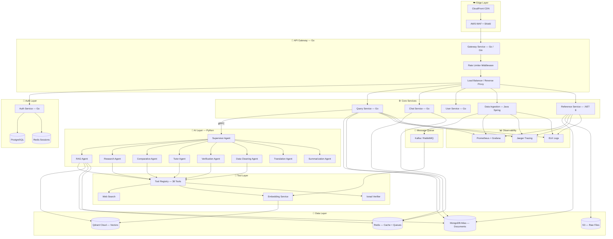
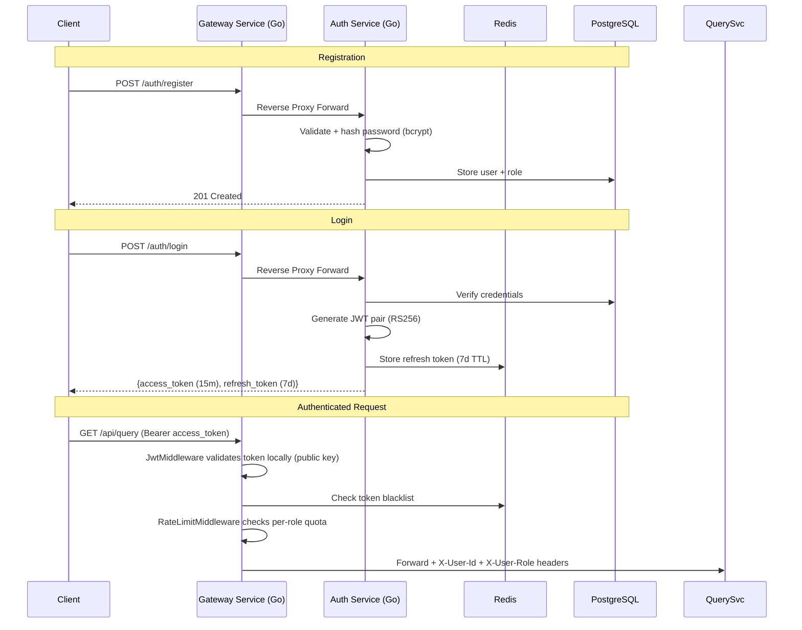
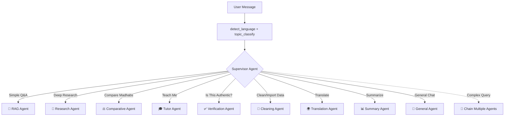
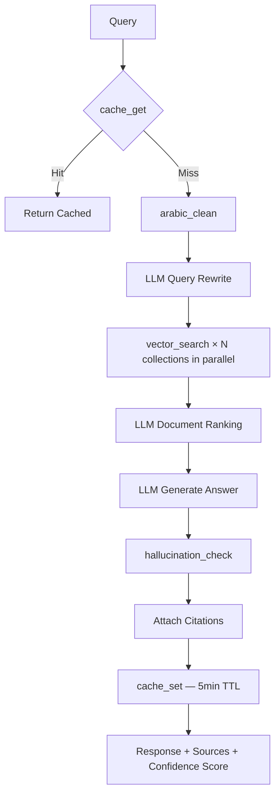
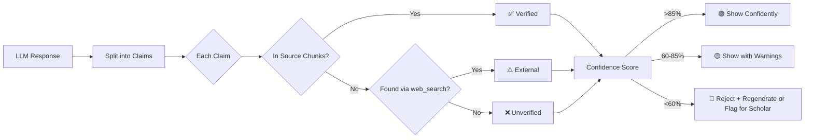

# 🕌 Mishkat Platform — Final Engineering Blueprint (Part 1/2)
## Architecture · Security · Agentic AI

> **Part 1** covers: Current State, Target Architecture, Tech Stack, Security, and Agent System  
> **Part 2** covers: Tool Registry, Reference System, DevOps, Frontend, Optimizations, and Roadmap

---

## 1. Current State Audit

| Component | Tech | Status | Gap |
|-----------|------|--------|-----|
| API Server | Python FastAPI monolith | ✅ Working | Single process, no horizontal scaling |
| Document DB | MongoDB (Motor async) | ✅ Working | No replica set, no sharding |
| Vector DB | Qdrant | ✅ Working | Single node |
| LLM Providers | Ollama, Google, HuggingFace, Cohere | ✅ Working | No fallback chain |
| Embedding | BGE-M3 (1024 dims) | ✅ Working | No embedding cache |
| Frontend | React + Vite + TailwindCSS v4 | ✅ Basic | Single-file App.tsx, no routing |
| Auth | bcrypt hashing only | ⚠️ Incomplete | No JWT, no RBAC, no OAuth |
| CORS | `allow_origins=["*"]` | ❌ Insecure | Wide open |
| Caching | None | ❌ Missing | Every query hits LLM + Qdrant |
| Observability | Sentry only | ⚠️ Minimal | No metrics, no tracing |
| RAG Pipeline | Query rewrite → Search → Rank → Generate | ✅ Working | No hallucination check, no web search |

### Architecture Debt
- `QueryController.py` (282 lines) handles rewriting, searching, ranking, and generating — should be separate services
- `lifespan.py` initializes everything in one place — tight coupling
- No message queue — batch ingestion blocks the API
- No rate limiting — vulnerable to abuse
- References limited to Bukhari + partial Muslim

---

## 2. Target Architecture



---

## 3. Hybrid Tech Stack

### Why Hybrid?
Each language is chosen for its **strongest domain** — not for uniformity.

| Service | Language | Framework | Justification |
|---------|----------|-----------|---------------|
| **API Gateway** | **Go** | Gin + httputil.ReverseProxy | Custom-built: full control, same language as core services, sub-ms routing, native middleware chain |
| **Auth Service** | **Go** | Gin | Sub-ms token validation, minimal memory, built for concurrency |
| **User Service** | **Go** | Gin | Simple CRUD, same deployment as Auth |
| **Chat Service** | **Go** | Gin + Gorilla WS | Native goroutines for WebSocket/SSE streaming |
| **Query Service** | **Go** | Gin + gRPC client | Orchestrates AI calls, handles backpressure, streams tokens |
| **Data Ingestion** | **Java** | Spring Boot 3 + Spring Batch | Enterprise batch processing, scheduling, transactional ETL |
| **Reference Service** | **.NET 8** | ASP.NET Minimal API | iText7 for PDF, NPOI for Excel, rich document parsing |
| **RAG Engine** | **Python** | FastAPI + LangGraph | Keep existing logic + LangChain + HuggingFace + agent framework |
| **Embedding Service** | **Python** | FastAPI + gRPC | Model inference, batch embedding |
| **Supervisor Agent** | **Python** | LangGraph | Multi-agent orchestration, tool routing |

### Communication Patterns

| Pattern | Where Used | Why |
|---------|-----------|-----|
| **gRPC** | Query Service ↔ RAG Engine, Auth ↔ User | Low latency, typed contracts, streaming support |
| **REST + JSON** | Client ↔ Gateway | Universal, human-readable |
| **Kafka** | Data Ingestion → Embedding Service | Async batch jobs, replay capability |
| **SSE** | Query Service → Client | Real-time token streaming |
| **WebSocket** | Chat Service ↔ Client | Bidirectional real-time |
| **Redis Pub/Sub** | Cross-service notifications | Lightweight event bus |

### Shared Protobuf Contracts

```protobuf
// proto/query.proto — shared between Go Query Service and Python RAG Engine
service RAGService {
  rpc Query (QueryRequest) returns (QueryResponse);
  rpc StreamQuery (QueryRequest) returns (stream TokenChunk);
  rpc SearchChunks (SearchRequest) returns (SearchResponse);
}

message QueryRequest {
  string query = 1;
  repeated string references = 2;
  string language = 3;
  int32 limit = 4;
  string chat_id = 5;
  string user_id = 6;
  string agent_type = 7;  // NEW: which agent to route to
}
```

---

## 4. Security Architecture

### 4.1 Authentication Flow



### 4.2 Authorization (RBAC)

| Role | Permissions |
|------|------------|
| **guest** | Read-only: basic RAG queries (5/hour), browse references |
| **student** | Everything guest + web search tools, save research, tutor agent, 50 queries/hour |
| **scholar** | Everything student + verification agent, PDF upload, full tool access, 200 queries/hour |
| **admin** | Everything + data ingestion, user management, system config, unlimited |

### 4.3 Infrastructure Security

| Layer | Implementation |
|-------|---------------|
| **Edge** | AWS WAF rules (SQL injection, XSS, bot detection), CloudFront with geo-restrictions |
| **Network** | VPC with private subnets for services, public subnet only for ALB |
| **Transport** | TLS 1.3 everywhere, mTLS between services via cert-manager |
| **CORS** | Whitelist: `mishkat.app`, `admin.mishkat.app` — no wildcards |
| **Rate Limiting** | Gateway middleware: sliding window per-role limits (Redis-backed, see RBAC table) |
| **Input Validation** | Protobuf schemas (gRPC), Pydantic models (Python), Bean Validation (Java) |
| **Secrets** | AWS Secrets Manager, rotated every 30 days, never in env files |
| **Containers** | Distroless base images, non-root users, Trivy scanning in CI |
| **Data at Rest** | AES-256 encryption (MongoDB Atlas, S3, PostgreSQL) |
| **Audit** | Every mutation → audit log (user, action, resource, timestamp, IP) |
| **Dependencies** | Dependabot + Snyk for vulnerability scanning |

### 4.4 Islamic Content Security

| Feature | Implementation |
|---------|---------------|
| **Source Attribution** | Every response MUST include: book, chapter, hadith number, narrator |
| **Hallucination Guard** | AI responses cross-validated against retrieved source chunks (see Section 5.5) |
| **Grading Filter** | Default: only Sahih/Hasan hadiths served. Da'if shown with ⚠️ warning |
| **Scholar Review Queue** | Responses with <60% confidence flagged for human scholar review |
| **Content Versioning** | Full audit trail on text changes — who edited what, when |
| **Anti-Fabrication** | `hallucination_check` tool runs on every RAG response |
| **Trusted Web Sources** | Web search restricted to whitelisted Islamic domains |

---

## 5. Agentic AI System

### 5.1 Supervisor Agent (Router)

The brain of the system — analyzes user intent and routes to specialist agents.



**Routing Examples:**

| User Query | Agent | Reason |
|------------|-------|--------|
| "ما حكم صلاة الجمعة؟" | RAG | Simple factual lookup |
| "ابحث عن كل أحاديث الزكاة مع التخريج" | Research | Multi-source deep research |
| "قارن المذاهب في حكم المسح على الخفين" | Comparative | Cross-madhab comparison |
| "اشرح لي أحاديث الصيام كمبتدئ" | Tutor | Adaptive learning |
| "هل حديث طلب العلم فريضة صحيح؟" | Verification | Isnad + grading check |
| "نظف ملف PDF وأضفه للقاعدة" | Cleaning | Admin data pipeline |
| "ترجم هذا الحديث للإنجليزية" | Translation | Language task |
| "لخص لي باب الطهارة" | Summary | Topic summarization |
| Chain example: "اجمع أحاديث الصدقة مع التخريج والترجمة" | Research → Verify → Translate | Multi-agent chain |

### 5.2 Agent Specifications

#### 📖 RAG Agent (Enhanced)
**Purpose:** Standard hadith Q&A — your current system, supercharged  
**Tools:** `vector_search`, `keyword_search`, `arabic_clean`, `embed_text`, `cache_get/set`, `hallucination_check`, `hadith_by_number`



**Improvements over current system:**
- Redis caching — repeated questions answered in <10ms
- Hallucination detection — every claim verified
- Parallel multi-collection search
- Auto-citation with book/chapter/number/narrator
- Confidence scoring (🟢🟡🔴)

#### 🔬 Research Agent
**Purpose:** Deep multi-source research with full citations  
**Tools:** `vector_search`, `web_search`, `web_scrape`, `quran_search`, `tafsir_lookup`, `cross_reference_search`, `narrator_search`, `fatwa_search`, `summarize_text`, `save_research`

**Workflow:** Creates a research plan → executes parallel searches across hadith collections, Quran, Tafsir, web sources, fatwa databases → deduplicates → synthesizes structured report → saves to user's library

#### ⚖️ Comparative Fiqh Agent
**Purpose:** Compare rulings across 4 madhabs  
**Tools:** `vector_search`, `web_search`, `fatwa_search`, `translate_text`, `topic_classify`

**Output:** Structured comparison table with evidence from each madhab, consensus points, and the strongest opinion

#### 🎓 Tutor Agent
**Purpose:** Adaptive Islamic learning with progress tracking  
**Tools:** `vector_search`, `quran_search`, `translate_text`, `summarize_text`, `cache_get/set`

**Features:** Detects student level → adjusts explanation depth → generates quizzes → tracks progress → suggests next topics in curriculum order

#### ✅ Verification Agent
**Purpose:** Full hadith authentication  
**Tools:** `verify_isnad`, `grade_hadith`, `narrator_search`, `cross_reference_search`, `web_search`, `call_sunnah_api`, `compare_narrations`

**Output Example:**
```
📋 Grade: ضعيف (Da'if)
🔗 Chain: أنس بن مالك ✅ → حفص بن سليمان ❌ (متروك)
📚 Cross-Refs: ابن ماجه 224, البيهقي شعب الإيمان
👨‍🏫 Scholars: الألباني — ضعيف, ابن حجر — ضعيف من جميع طرقه
⚠️ Meaning supported by stronger hadiths
```

#### 🧹 Data Cleaning Agent
**Purpose:** Process raw Islamic texts into searchable data  
**Tools:** `arabic_clean`, `arabic_diacritize`, `parse_pdf`, `parse_html`, `detect_language`, `extract_keywords`, `chunk_text`, `embed_text`, `store_vector`, `topic_classify`

#### 🌍 Translation Agent
**Purpose:** Accurate Islamic text translation (8 languages)  
**Tools:** `translate_text`, `transliterate`, `detect_language`, `arabic_diacritize`  
**Languages:** Arabic, English, Urdu, French, Turkish, Malay, Indonesian, Bengali

#### 📊 Summarization Agent
**Purpose:** Generate topic overviews, study notes, conversation summaries  
**Tools:** `vector_search`, `summarize_text`, `topic_classify`, `extract_keywords`, `save_research`

#### 💬 General Agent
**Purpose:** Handle conversational/non-Islamic queries gracefully  
**Tools:** `web_search`, `translate_text`, `detect_language`  
**Behavior:** Politely redirects to Islamic topics when appropriate, handles greetings and meta-questions

### 5.3 Multi-Agent Chaining

Complex queries trigger multiple agents in sequence or parallel:

```
User: "اجمع أحاديث الصدقة مع التخريج والترجمة الإنجليزية"

Supervisor creates execution plan:
┌─────────────────────────────────────────┐
│ Step 1 (Parallel):                       │
│   Research Agent → collect hadiths        │
│   Verification Agent → grade each one    │
├─────────────────────────────────────────┤
│ Step 2 (Sequential, after Step 1):       │
│   Translation Agent → translate to EN    │
├─────────────────────────────────────────┤
│ Step 3:                                  │
│   Summarization Agent → structure report │
│   save_research → store in user library  │
└─────────────────────────────────────────┘
```

### 5.4 Agent Memory System

| Type | Storage | TTL | Purpose |
|------|---------|-----|---------|
| **Short-term** | Redis | Session | Current conversation context |
| **Working** | In-process | Request | Tools called, intermediate results |
| **Long-term** | MongoDB | Permanent | User preferences, learning progress, saved research |
| **Semantic** | Qdrant | Permanent | Past research embeddings for "remember" queries |
| **Episodic** | MongoDB | 90 days | Summarized past conversations |

### 5.5 Hallucination Prevention


