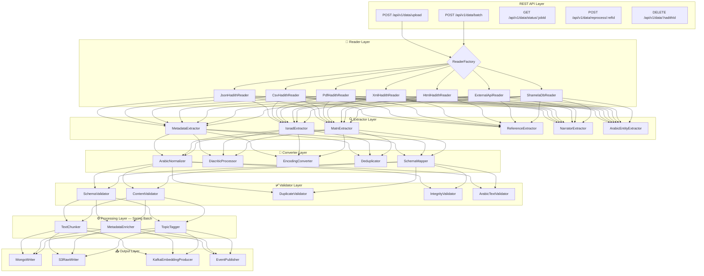
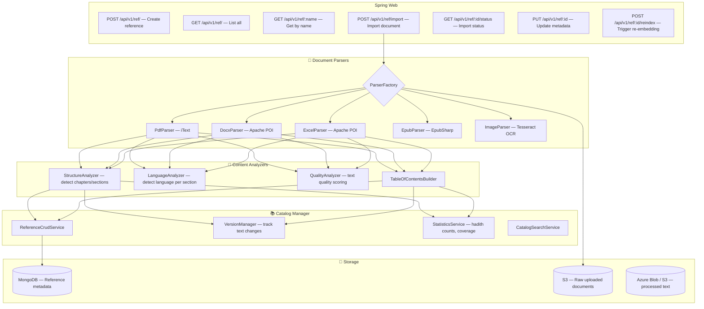
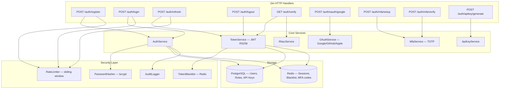
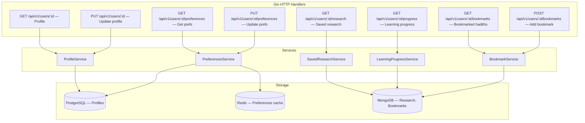

# 🕌 Mishkat Platform — Final Engineering Blueprint (Part 3A)
## Deep Service Architecture: Gateway · Data Pipeline · Reference · Auth · User

> **Part 3A** covers: Gateway Service, Data Ingestion Service, Reference Service, Auth Service, User Service  
> **Part 3B** covers: Query Service, Chat Service, RAG Engine, Embedding Service, Agent Orchestrator

---

## S0. Gateway Service — Go (Gin + httputil.ReverseProxy)

### Purpose
Custom-built API Gateway — the single entry point for all client traffic. Handles reverse proxying, JWT validation, rate limiting, CORS, request/response logging, and health checking. Built in Go for sub-millisecond routing overhead and native concurrency.

### Why Custom Instead of Kong/Envoy?
| Aspect | Kong/Envoy | Custom Go Gateway |
|--------|-----------|-------------------|
| Control | Plugin-based, limited customization | Full control over every middleware |
| Language | Lua (Kong) / C++ (Envoy) — foreign to team | Go — same as core services, shared `pkg/jwt` |
| Deployment | Separate infra, separate config format | Same CI/CD, same Docker, same Helm chart |
| Performance | ~2ms overhead per request | ~0.3ms overhead per request |
| Islamic-specific | N/A | Custom Arabic query normalization at gateway |
| Cost | Kong Enterprise $$$ for advanced features | Free — you own it |

### Internal Architecture

```mermaid
flowchart TD
    subgraph Entry["🌐 Entry Point"]
        HTTP["HTTP/HTTPS Listener :443"]
        WS_UPGRADE["WebSocket Upgrade Handler"]
    end

    subgraph Middleware["⛓️ Middleware Chain (in order)"]
        M1["1. RecoveryMiddleware — panic recovery"]
        M2["2. RequestIdMiddleware — unique X-Request-Id"]
        M3["3. LoggerMiddleware — structured JSON logging"]
        M4["4. TracingMiddleware — Jaeger span injection"]
        M5["5. CorsMiddleware — whitelist origins"]
        M6["6. RateLimitMiddleware — sliding window per IP/user"]
        M7["7. JwtMiddleware — RS256 validation + role extraction"]
        M8["8. RequestSanitizerMiddleware — input cleaning"]
    end

    subgraph Router["🔀 Route Registry"]
        ROUTES[RouteConfig — YAML-driven]
        MATCHER[PathMatcher — prefix routing]
        HEALTH[HealthAggregator — /health checks all services]
    end

    subgraph Proxy["🔄 Reverse Proxy"]
        RP[httputil.ReverseProxy]
        LB_PROXY[RoundRobinBalancer — multiple instances]
        CB[CircuitBreaker — per-service]
        RETRY_P[RetryPolicy — 2 retries on 5xx]
        TIMEOUT[TimeoutEnforcer — 30s default]
    end

    subgraph Observability["📊 Metrics"]
        PROM_GW[Prometheus: request_total, latency_ms, status_codes]
        DASH[/metrics endpoint for Grafana]
    end

    HTTP & WS_UPGRADE --> M1 --> M2 --> M3 --> M4 --> M5 --> M6 --> M7 --> M8
    M8 --> ROUTES --> MATCHER
    MATCHER --> RP --> LB_PROXY --> CB --> RETRY_P --> TIMEOUT
    RP --> PROM_GW --> DASH
    ROUTES --> HEALTH
```

### Middleware Chain Detail

| # | Middleware | Responsibility |
|---|-----------|---------------|
| 1 | `RecoveryMiddleware` | Catches panics, returns 500 with trace ID, logs stack trace |
| 2 | `RequestIdMiddleware` | Generates UUID `X-Request-Id`, propagates to all downstream services |
| 3 | `LoggerMiddleware` | Structured JSON log: method, path, status, latency, user_id, request_id |
| 4 | `TracingMiddleware` | Injects Jaeger/OpenTelemetry span, passes `traceparent` header downstream |
| 5 | `CorsMiddleware` | Whitelists `mishkat.app`, `admin.mishkat.app`. Rejects unknown origins. Handles preflight. |
| 6 | `RateLimitMiddleware` | Redis-backed sliding window. Limits per role: guest=5/hr, student=50/hr, scholar=200/hr, admin=unlimited. Returns `429 Too Many Requests` with `Retry-After` header. |
| 7 | `JwtMiddleware` | Validates JWT using RS256 public key (loaded at startup). Extracts `user_id`, `role`, `permissions`. Sets `X-User-Id` and `X-User-Role` headers for downstream. Skips for public routes (`/auth/login`, `/auth/register`, `/health`). Checks Redis token blacklist. |
| 8 | `RequestSanitizerMiddleware` | Strips dangerous characters, validates Content-Type, enforces max body size (10MB) |

### Route Configuration (YAML-driven)

```yaml
# config/routes.yml
routes:
  - prefix: /auth
    upstream: http://auth-service:8001
    strip_prefix: false
    public: true                    # Skip JWT middleware
    rate_limit: 20/min              # Stricter for auth endpoints

  - prefix: /api/v1/query
    upstream: http://query-service:8002
    strip_prefix: false
    public: false
    timeout: 120s                   # Longer for AI responses
    websocket: false

  - prefix: /api/v1/chats
    upstream: http://chat-service:8003
    strip_prefix: false
    public: false

  - prefix: /api/v1/ws
    upstream: http://chat-service:8003
    strip_prefix: false
    public: false
    websocket: true                 # Enable WebSocket upgrade

  - prefix: /api/v1/users
    upstream: http://user-service:8004
    strip_prefix: false
    public: false

  - prefix: /api/v1/data
    upstream: http://data-service:8005
    strip_prefix: false
    public: false
    required_role: admin            # Only admins

  - prefix: /api/v1/ref
    upstream: http://reference-service:8006
    strip_prefix: false
    public: false

health_checks:
  interval: 10s
  services:
    - name: auth
      url: http://auth-service:8001/health
    - name: query
      url: http://query-service:8002/health
    - name: chat
      url: http://chat-service:8003/health
    - name: data
      url: http://data-service:8005/health
    - name: reference
      url: http://reference-service:8006/health
```

### Health Aggregator

```
GET /health → aggregates all service health checks

Response:
{
  "status": "healthy",
  "uptime": "72h15m",
  "services": {
    "auth": {"status": "healthy", "latency_ms": 2},
    "query": {"status": "healthy", "latency_ms": 5},
    "chat": {"status": "healthy", "latency_ms": 3},
    "data": {"status": "healthy", "latency_ms": 8},
    "reference": {"status": "healthy", "latency_ms": 4},
    "rag-engine": {"status": "degraded", "latency_ms": 150, "note": "high load"}
  }
}
```

### Directory Structure
```
gateway-service/
├── cmd/
│   └── main.go                      # Entry point — loads config, starts server
├── internal/
│   ├── middleware/
│   │   ├── recovery.go              # Panic recovery
│   │   ├── request_id.go            # UUID generation
│   │   ├── logger.go                # Structured JSON logging
│   │   ├── tracing.go               # OpenTelemetry/Jaeger
│   │   ├── cors.go                  # Origin whitelist
│   │   ├── rate_limiter.go          # Redis sliding window
│   │   ├── jwt_validator.go         # RS256 validation + role extraction
│   │   └── sanitizer.go             # Input cleaning
│   ├── proxy/
│   │   ├── reverse_proxy.go         # httputil.ReverseProxy wrapper
│   │   ├── round_robin.go           # Load balancing
│   │   ├── circuit_breaker.go       # Per-service circuit breaker
│   │   ├── retry_policy.go          # Retry on 5xx
│   │   └── websocket_proxy.go       # WebSocket upgrade handling
│   ├── router/
│   │   ├── route_config.go          # YAML route loader
│   │   ├── path_matcher.go          # Prefix-based routing
│   │   └── health_aggregator.go     # /health endpoint
│   ├── metrics/
│   │   └── prometheus.go            # Request counters, latency histograms
│   └── config/
│       ├── config.go                # App config (ports, Redis URL, JWT keys)
│       └── routes.yml               # Route definitions
├── pkg/
│   └── jwt/                         # Shared JWT utils (same as auth-service)
├── go.mod
└── Dockerfile
```

---

## S1. Data Ingestion Service — Java Spring Boot 3

### Purpose
Enterprise-grade ETL pipeline for ingesting Islamic texts from any source format, validating, cleaning, chunking, and triggering vector embedding.

### Internal Architecture



### Module Breakdown

#### 📖 Readers — `com.mishkat.data.readers`

Each reader implements `HadithReader` interface and handles one source format:

```java
public interface HadithReader {
    List<RawHadithRecord> read(InputStream source, ReaderConfig config);
    boolean supports(String mimeType);
    String getReaderName();
}
```

| Reader | Source | Details |
|--------|--------|---------|
| `JsonHadithReader` | `.json` files | Handles your current `elbokhary.json` and `muslim.json` format. Supports nested structures, arrays of hadiths. Uses Jackson streaming for large files (64MB+). |
| `CsvHadithReader` | `.csv` / `.tsv` | Column-mapped hadith import. Configurable column mapping via `ReaderConfig`. For bulk academic datasets. |
| `PdfHadithReader` | `.pdf` books | Uses Apache PDFBox. OCR fallback via Tesseract for scanned manuscripts. Arabic text extraction with right-to-left handling. Page-by-page hadith boundary detection. |
| `XmlHadithReader` | `.xml` / TEI format | For academic XML-encoded hadith corpora. Supports TEI (Text Encoding Initiative) format used in digital humanities. |
| `HtmlHadithReader` | `.html` web pages | Jsoup-based. Extracts hadiths from structured HTML (islamweb.net, sunnah.com page dumps). CSS selector configurable. |
| `ExternalApiReader` | REST APIs | Pulls from sunnah.com API, islamqa.info API, al-maktaba.org. Handles pagination, rate limiting, retry logic. |
| `ShamelaDbReader` | Shamela `.bok` files | Reads المكتبة الشاملة database format. SQLite-based extraction of books, chapters, hadiths. |

**ReaderFactory** auto-detects format:
```java
@Component
public class ReaderFactory {
    public HadithReader getReader(String mimeType, String extension) {
        // Auto-detect: "application/json" → JsonHadithReader
        // Fallback: extension ".pdf" → PdfHadithReader
        // Unknown: throw UnsupportedFormatException
    }
}
```

#### 🔍 Extractors — `com.mishkat.data.extractors`

Each extractor pulls specific structured data from raw text:

```java
public interface HadithExtractor<T> {
    T extract(RawHadithRecord record);
    String getExtractorName();
}
```

| Extractor | Input | Output | Logic |
|-----------|-------|--------|-------|
| `MetadataExtractor` | Raw record | `HadithMetadata` (book, chapter, number, page) | Regex patterns for hadith numbering systems (e.g., "كتاب الإيمان - باب 3 - حديث 8") |
| `IsnadExtractor` | Hadith text | `IsnadChain` (list of narrator names in order) | Arabic NLP: detects "حدثنا", "أخبرنا", "عن" patterns to split chain |
| `MatnExtractor` | Hadith text | `MatnText` (core hadith text without isnad) | Separates the Prophet's words from the narrator chain |
| `ReferenceExtractor` | Raw record | `ReferenceInfo` (source book, volume, page) | Maps to standardized reference system |
| `NarratorExtractor` | Isnad chain | `List<Narrator>` (name, generation, grading) | Cross-references with Rijal database |
| `ArabicEntityExtractor` | Any text | `List<Entity>` (persons, places, Quran refs) | NER for Islamic texts — detects صلى الله عليه وسلم, Quran verse refs, place names |

#### 🔄 Converters — `com.mishkat.data.converters`

| Converter | Input → Output | Logic |
|-----------|---------------|-------|
| `ArabicNormalizer` | Raw Arabic → Clean Arabic | Same as your current `clean()`: strip tashkeel, normalize alef/hamza/ta-marbuta, remove URLs, normalize whitespace |
| `DiacriticProcessor` | Text → Text ± diacritics | Option to strip or add tashkeel. Uses lookup tables for common words. |
| `EncodingConverter` | Any encoding → UTF-8 | Handles Windows-1256, ISO-8859-6, CP720 (common in old Arabic files) |
| `Deduplicator` | List of hadiths → Deduplicated list | Fuzzy matching using Jaccard similarity on normalized text. Configurable threshold (default 0.85). |
| `SchemaMapper` | Raw record → `HadithDocument` | Maps any reader output to the unified internal schema |

#### ✅ Validators — `com.mishkat.data.validators`

```java
public interface HadithValidator {
    ValidationResult validate(HadithDocument doc);
    int getPriority();  // execution order
}
```

| Validator | Checks | Fails If |
|-----------|--------|----------|
| `SchemaValidator` | Required fields present (text, source, narrator) | Missing mandatory fields |
| `ContentValidator` | Text length > 10 chars, Arabic content ratio > 60% | Empty or non-Arabic content |
| `DuplicateValidator` | Not already in MongoDB | Exact or fuzzy duplicate found |
| `IntegrityValidator` | Hadith number matches source's known count | Number out of range for that book |
| `ArabicTextValidator` | Valid Arabic characters, no mojibake | Encoding corruption detected |

Validators run in pipeline — first failure stops processing and logs the error.

#### ⚙️ Processing — Spring Batch Jobs

```java
@Configuration
public class HadithIngestionJobConfig {
    
    @Bean
    public Job hadithIngestionJob() {
        return jobBuilder.get("hadithIngestionJob")
            .start(readStep())        // Reader → RawHadithRecord
            .next(extractStep())      // Extractors → structured data
            .next(convertStep())      // Converters → normalized
            .next(validateStep())     // Validators → pass/fail
            .next(chunkStep())        // TextChunker → chunks
            .next(enrichStep())       // MetadataEnricher + TopicTagger
            .next(writeStep())        // MongoDB + S3 + Kafka
            .listener(jobListener())  // Status tracking + notifications
            .build();
    }
}
```

**Job Status Tracking:**
```json
// GET /api/v1/data/status/job-123
{
  "job_id": "job-123",
  "status": "RUNNING",
  "reference": "bukhari",
  "total_records": 7563,
  "processed": 4200,
  "failed": 12,
  "chunks_created": 8400,
  "embeddings_queued": 8400,
  "started_at": "2026-05-14T10:00:00Z",
  "estimated_completion": "2026-05-14T10:45:00Z",
  "errors": [
    {"record": 1523, "error": "DuplicateValidator: exact match found", "severity": "WARN"}
  ]
}
```

### Directory Structure
```
data-service/
├── src/main/java/com/mishkat/data/
│   ├── DataServiceApplication.java
│   ├── config/
│   │   ├── KafkaConfig.java
│   │   ├── MongoConfig.java
│   │   ├── S3Config.java
│   │   └── BatchConfig.java
│   ├── api/
│   │   ├── DataController.java
│   │   └── dto/
│   │       ├── UploadRequest.java
│   │       ├── BatchRequest.java
│   │       └── JobStatusResponse.java
│   ├── readers/
│   │   ├── HadithReader.java          # Interface
│   │   ├── ReaderFactory.java
│   │   ├── JsonHadithReader.java
│   │   ├── CsvHadithReader.java
│   │   ├── PdfHadithReader.java
│   │   ├── XmlHadithReader.java
│   │   ├── HtmlHadithReader.java
│   │   ├── ExternalApiReader.java
│   │   └── ShamelaDbReader.java
│   ├── extractors/
│   │   ├── HadithExtractor.java       # Interface
│   │   ├── MetadataExtractor.java
│   │   ├── IsnadExtractor.java
│   │   ├── MatnExtractor.java
│   │   ├── ReferenceExtractor.java
│   │   ├── NarratorExtractor.java
│   │   └── ArabicEntityExtractor.java
│   ├── converters/
│   │   ├── ArabicNormalizer.java
│   │   ├── DiacriticProcessor.java
│   │   ├── EncodingConverter.java
│   │   ├── Deduplicator.java
│   │   └── SchemaMapper.java
│   ├── validators/
│   │   ├── HadithValidator.java       # Interface
│   │   ├── SchemaValidator.java
│   │   ├── ContentValidator.java
│   │   ├── DuplicateValidator.java
│   │   ├── IntegrityValidator.java
│   │   └── ArabicTextValidator.java
│   ├── processing/
│   │   ├── TextChunker.java
│   │   ├── MetadataEnricher.java
│   │   └── TopicTagger.java
│   ├── output/
│   │   ├── MongoWriter.java
│   │   ├── S3RawWriter.java
│   │   ├── KafkaEmbeddingProducer.java
│   │   └── EventPublisher.java
│   ├── batch/
│   │   ├── HadithIngestionJobConfig.java
│   │   ├── JobStatusService.java
│   │   └── FailureHandler.java
│   └── domain/
│       ├── RawHadithRecord.java
│       ├── HadithDocument.java
│       ├── HadithMetadata.java
│       ├── IsnadChain.java
│       ├── MatnText.java
│       └── ValidationResult.java
├── src/main/resources/
│   ├── application.yml
│   └── reader-configs/              # Per-source reader configs
│       ├── bukhari.yml
│       ├── muslim.yml
│       └── sunnah-api.yml
└── pom.xml
```

---

## S2. Reference Service — Java 21

### Purpose
Manages reference sources (books, collections), handles complex document parsing (PDF manuscripts, scanned pages), and maintains the reference catalog.

### Internal Architecture



### Document Parsers Detail

| Parser | Library | Capabilities |
|--------|---------|-------------|
| `PdfParser` | **iText** | Extract text preserving Arabic RTL, detect columns, handle embedded fonts, extract images + footnotes |
| `DocxParser` | **Apache POI** | Parse Word documents with Arabic text, extract tables, headers, footnotes |
| `ExcelParser` | **Apache POI** | Import hadith databases stored in Excel (common for academic datasets). Column mapping config. |
| `EpubParser` | **EpubSharp** | Parse Islamic e-books in EPUB format. Chapter-aware extraction. |
| `ImageParser` | **Tesseract OCR** | OCR for scanned manuscript pages. Arabic model + custom Islamic terms dictionary for accuracy. |

### Directory Structure
```
reference-service/
├── src/
│   ├── Program.cs
│   ├── Endpoints/
│   │   ├── ReferenceEndpoints.cs
│   │   └── ImportEndpoints.cs
│   ├── Parsers/
│   │   ├── IDocumentParser.cs         # Interface
│   │   ├── ParserFactory.cs
│   │   ├── PdfParser.cs
│   │   ├── DocxParser.cs
│   │   ├── ExcelParser.cs
│   │   ├── EpubParser.cs
│   │   └── ImageParser.cs
│   ├── Analyzers/
│   │   ├── StructureAnalyzer.cs
│   │   ├── LanguageAnalyzer.cs
│   │   ├── QualityAnalyzer.cs
│   │   └── TableOfContentsBuilder.cs
│   ├── Services/
│   │   ├── ReferenceCrudService.cs
│   │   ├── VersionManager.cs
│   │   ├── StatisticsService.cs
│   │   └── CatalogSearchService.cs
│   ├── Models/
│   │   ├── Reference.cs
│   │   ├── ImportJob.cs
│   │   ├── ParsedDocument.cs
│   │   └── TextQualityReport.cs
│   └── Infrastructure/
│       ├── MongoContext.cs
│       └── S3StorageClient.cs
└── ReferenceService.csproj
```

---

## S3. Auth Service — Java (Gin)

### Purpose
High-performance authentication and authorization. Handles JWT lifecycle, OAuth2, RBAC, MFA, and API key management.

### Internal Architecture



### Module Detail

| Module | Responsibility |
|--------|---------------|
| `AuthService` | Register, login, credential validation, account lockout after 5 failed attempts |
| `TokenService` | JWT generation (RS256, 15min access, 7d refresh), validation, rotation, blacklisting |
| `OAuthService` | Google, GitHub, Apple OAuth2 flows. Creates/links user accounts on first login. |
| `MfaService` | TOTP setup (QR code), verification. Required for admin/scholar roles. |
| `ApiKeyService` | Generate/revoke API keys for B2B. Hashed storage, rate-limited separately. |
| `RbacService` | Role checking: `guest → student → scholar → admin`. Permission matrix enforcement. |
| `PasswordHasher` | bcrypt with cost factor 12. Migrates from your current passlib setup. |
| `TokenBlacklist` | Redis SET of revoked JWT IDs. Checked on every verify call. TTL = token expiry. |
| `AuditLogger` | Logs: login success/fail, role changes, token revocations. Kafka event stream. |

### Directory Structure
```
auth-service/
├── cmd/
│   └── main.go
├── internal/
│   ├── handlers/
│   │   ├── auth_handler.go
│   │   ├── oauth_handler.go
│   │   ├── mfa_handler.go
│   │   └── apikey_handler.go
│   ├── services/
│   │   ├── auth_service.go
│   │   ├── token_service.go
│   │   ├── oauth_service.go
│   │   ├── mfa_service.go
│   │   ├── apikey_service.go
│   │   └── rbac_service.go
│   ├── security/
│   │   ├── password_hasher.go
│   │   ├── token_blacklist.go
│   │   ├── rate_limiter.go
│   │   └── audit_logger.go
│   ├── models/
│   │   ├── user.go
│   │   ├── role.go
│   │   ├── token_claims.go
│   │   └── api_key.go
│   ├── repository/
│   │   ├── user_repo.go         # PostgreSQL
│   │   ├── role_repo.go
│   │   └── apikey_repo.go
│   ├── middleware/
│   │   ├── jwt_middleware.go    # Extracts + validates JWT
│   │   ├── rbac_middleware.go   # Checks role permissions
│   │   └── rate_middleware.go
│   └── config/
│       └── config.go
├── pkg/
│   ├── jwt/                     # JWT utilities (shared with other Go services)
│   └── crypto/
├── go.mod
└── Dockerfile
```

---

## S4. User Service — Go (Gin)

### Purpose
User profile management, preferences, learning progress, saved research. Separated from Auth for single-responsibility.

### Internal Architecture



### User Preferences Model

```json
{
  "user_id": "usr_12345",
  "language": "ar",
  "preferred_madhab": "shafi'i",
  "default_references": ["bukhari", "muslim"],
  "theme": "dark",
  "font_size": "medium",
  "show_diacritics": true,
  "show_translation": true,
  "translation_language": "en",
  "agent_preference": "auto",
  "notifications": {
    "daily_hadith": true,
    "learning_reminders": true,
    "research_updates": false
  }
}
```

### Directory Structure
```
user-service/
├── cmd/
│   └── main.go
├── internal/
│   ├── handlers/
│   │   ├── profile_handler.go
│   │   ├── preferences_handler.go
│   │   ├── research_handler.go
│   │   ├── progress_handler.go
│   │   └── bookmark_handler.go
│   ├── services/
│   │   ├── profile_service.go
│   │   ├── preferences_service.go
│   │   ├── saved_research_service.go
│   │   ├── learning_progress_service.go
│   │   └── bookmark_service.go
│   ├── models/
│   │   ├── user_profile.go
│   │   ├── preferences.go
│   │   ├── research_doc.go
│   │   ├── learning_progress.go
│   │   └── bookmark.go
│   ├── repository/
│   │   ├── profile_repo.go       # PostgreSQL
│   │   ├── research_repo.go      # MongoDB
│   │   └── bookmark_repo.go      # MongoDB
│   └── middleware/
│       └── auth_middleware.go     # Validates JWT from Auth Service
├── go.mod
└── Dockerfile
```
---

## S5. Billing Service — Java (Gin) 🪙

### Overview

The **Billing Service** implements a **coins-based economy** for the Mishkat platform. Users purchase coins (via Stripe or other payment gateways) and spend them to use premium features — advanced AI agents, deep research, PDF exports, and more. Each operation has a defined coin price, and the service enforces balance checks atomically before any chargeable request is processed.

**Why Coins?**
- Decouples monetary pricing from usage costs — coin prices are set internally and can be adjusted without touching payment infrastructure
- Works across currencies naturally (coins have a fixed exchange rate per purchase package)
- Enables subscriptions, gifting, scholarships, and institutional bulk grants
- Simplifies micro-billing — charging $0.003 per query is impractical via Stripe; deducting 1 coin is instant

---

### Coin Economy Design

#### Coin Packages (Purchase)

| Package | Coins | Price (USD) | Per-Coin Rate | Notes |
|---------|-------|-------------|--------------|-------|
| Starter | 100 coins | $2.99 | $0.030/coin | One-time |
| Standard | 500 coins | $9.99 | $0.020/coin | Most popular |
| Scholar | 2,000 coins | $29.99 | $0.015/coin | For researchers |
| Institution | 10,000 coins | $99.99 | $0.010/coin | Bulk — admin grants |
| Free Tier | 20 coins/month | Free | — | Auto-granted monthly |

#### Feature Pricing (Coin Cost per Operation)

| Feature | Agent/Tool | Coin Cost | Notes |
|---------|-----------|-----------|-------|
| Basic Q&A | RAG Agent | 1 coin | Standard hadith lookup |
| Research Report | Research Agent | 5 coins | Multi-source deep research |
| Madhab Comparison | Comparative Agent | 3 coins | Cross-madhab analysis |
| Hadith Verification | Verification Agent | 3 coins | Full Isnad analysis |
| Translation | Translation Agent | 2 coins | Per language pair |
| Summarization | Summary Agent | 2 coins | Topic overview |
| PDF Export | Reference Service | 3 coins | Download research as PDF |
| Automation Pipeline Run | Automation Service | 5 coins | Per pipeline execution |
| Skill Execution | Skill Registry | 2–10 coins | Varies by skill complexity |
| Web Search (per call) | Tool: `web_search` | 1 coin | External API cost passthrough |
| CLI Query (`msk query`) | RAG Agent | 1 coin | Same as in-app |
| CLI Research | Research Agent | 5 coins | Same as in-app |

> **Free operations (0 coins):** Basic chat with General Agent, browsing the reference library, viewing saved research, using the Tutor Agent (first 5 queries/day), CLI `msk knowledge stats`, auth operations.

---

### Architecture

```mermaid
flowchart TD
    subgraph Client["🖥️ Client (Web / CLI / Mobile)"]
        USER[User Action — "Run Research Agent"]
    end

    subgraph Gateway["🚪 API Gateway — Go"]
        GW[Gateway Service]
        COIN_MW[CoinCheckMiddleware]
    end

    subgraph Billing["💰 Billing Service — Java"]
        subgraph API_B["REST API"]
            B1["POST /billing/coins/purchase"]
            B2["GET /billing/coins/balance"]
            B3["POST /billing/coins/deduct — internal"]
            B4["POST /billing/coins/refund — internal"]
            B5["GET /billing/transactions"]
            B6["POST /billing/coins/grant — admin"]
            B7["GET /billing/pricing"]
        end

        subgraph Core_B["Core Services"]
            WALLET[WalletService — balance management]
            LEDGER[LedgerService — immutable transaction log]
            PRICER[PricingService — feature → coin cost]
            PAYMENT[PaymentService — Stripe integration]
            GRANT[GrantService — admin coin grants]
        end

        subgraph Safety["⚛️ Atomicity Layer"]
            LOCK[DistributedLock — Redis]
            IDEMPOTENT[IdempotencyKey — deduplicate charges]
        end
    end

    subgraph Downstream["⚙️ Chargeable Services"]
        QS[Query Service]
        RAG[RAG Engine]
        AUTO[Automation Service]
        REF[Reference Service]
    end

    subgraph Storage_B["💾 Storage"]
        PG_B[(PostgreSQL — wallets, transactions)]
        REDIS_B[(Redis — balance cache, locks)]
        STRIPE[(Stripe API)]
    end

    USER --> GW --> COIN_MW
    COIN_MW -->|check balance| WALLET
    COIN_MW -->|if sufficient| QS & RAG & AUTO & REF
    COIN_MW -->|deduct on success| LEDGER

    B1 --> PAYMENT --> STRIPE
    PAYMENT -->|on success| WALLET
    B2 --> WALLET --> REDIS_B
    B3 --> LOCK --> LEDGER --> PG_B
    B4 --> LEDGER
    B6 --> GRANT --> WALLET

    WALLET --> PG_B
    LEDGER --> PG_B
  
```plain
1. User clicks "Buy 500 coins" in UI
2. Frontend → POST /billing/coins/purchase {package: "standard", payment_method_id: "pm_xxx"}
3. Billing Service → PaymentService → Stripe API (charge $9.99)
4. Stripe confirms → PaymentService returns success
5. WalletService → atomically add 500 coins to user balance
6. LedgerService → record: {type: CREDIT, amount: 500, source: PURCHASE, stripe_payment_id: "pi_xxx"}
7. Return updated balance to user
```

```plain
1. User → POST /api/v1/query {query: "اجمع أحاديث الصيام", agent: "research"}
2. Gateway → CoinCheckMiddleware → GET user balance from Redis cache
3. PricingService → lookup "research" agent → cost = 5 coins
4. If balance < 5 → return 402 Payment Required {"error": "insufficient_coins", "required": 5, "balance": 3}
5. If balance >= 5:
   a. Acquire distributed lock on user_id (Redis SETNX, 10s TTL)
   b. Re-check balance from PostgreSQL (prevent race conditions)
   c. Deduct 5 coins atomically (UPDATE wallet SET balance = balance - 5 WHERE user_id = ? AND balance >= 5)
   d. If UPDATE affected 0 rows → insufficient balance (race lost) → 402
   e. Insert ledger row: {type: DEBIT, amount: 5, feature: "research_agent", request_id: "req_xxx"}
   f. Release lock
   g. Forward request to Query Service
6. On upstream error (RAG Engine fails, timeout) → Billing Service refunds 5 coins automatically
```

```json
{
  "package_id": "standard",
  "payment_method_id": "pm_stripe_xxx",
  "idempotency_key": "buy_abc123"
}

// Response 200:
{
  "transaction_id": "txn_xyz",
  "coins_added": 500,
  "new_balance": 523,
  "stripe_payment_id": "pi_xxx",
  "receipt_url": "[https://receipt.stripe.com/](https://receipt.stripe.com/)..."
}
```


```json
// Response 200:
{
  "transactions": [
    {
      "id": "txn_001",
      "type": "DEBIT",
      "amount": 5,
      "feature": "research_agent",
      "description": "Research Agent — أحاديث الصيام",
      "balance_after": 518,
      "timestamp": "2026-05-14T10:00:00Z"
    },
    {
      "id": "txn_002",
      "type": "CREDIT",
      "amount": 500,
      "source": "PURCHASE",
      "description": "Standard Package — 500 coins",
      "balance_after": 523,
      "timestamp": "2026-05-14T09:00:00Z"
    }
  ],
  "total": 47,
  "page": 1
}

```

```json 
// Response 200:
{
  "transactions": [
    {
      "id": "txn_001",
      "type": "DEBIT",
      "amount": 5,
      "feature": "research_agent",
      "description": "Research Agent — أحاديث الصيام",
      "balance_after": 518,
      "timestamp": "2026-05-14T10:00:00Z"
    },
    {
      "id": "txn_002",
      "type": "CREDIT",
      "amount": 500,
      "source": "PURCHASE",
      "description": "Standard Package — 500 coins",
      "balance_after": 523,
      "timestamp": "2026-05-14T09:00:00Z"
    }
  ],
  "total": 47,
  "page": 1
}
```

```json 
// Response 200:
{
  "features": [
    {"feature": "rag_agent",          "coins": 1, "description": "Basic Q&A"},
    {"feature": "research_agent",     "coins": 5, "description": "Deep Research Report"},
    {"feature": "verification_agent", "coins": 3, "description": "Hadith Verification"},
    {"feature": "comparative_agent",  "coins": 3, "description": "Madhab Comparison"},
    {"feature": "translation_agent",  "coins": 2, "description": "Translation"},
    {"feature": "summary_agent",      "coins": 2, "description": "Summarization"},
    {"feature": "pdf_export",         "coins": 3, "description": "Export as PDF"},
    {"feature": "automation_run",     "coins": 5, "description": "Pipeline Execution"},
    {"feature": "web_search_call",    "coins": 1, "description": "External web search (per call)"}
  ],
  "packages": [
    {"id": "starter",     "coins": 100,   "price_usd": 2.99},
    {"id": "standard",    "coins": 500,   "price_usd": 9.99},
    {"id": "scholar",     "coins": 2000,  "price_usd": 29.99},
    {"id": "institution", "coins": 10000, "price_usd": 99.99}
  ]
}
```

```json
{
  "user_id": "usr_12345",
  "amount": 200,
  "reason": "scholarship_grant",
  "expires_at": "2027-01-01T00:00:00Z"
}

// Response 200:
{
  "granted": 200,
  "new_balance": 723,
  "grant_id": "grant_abc"
}
```

```go 
// gateway-service/internal/middleware/coin_check_middleware.go

type CoinCheckMiddleware struct {
    billingClient billing.Client   // gRPC or HTTP client to Billing Service
    pricingCache  *PricingCache    // In-memory pricing table, refreshed every 5min
}

func (m *CoinCheckMiddleware) Handle(c *gin.Context) {
    userID := c.GetHeader("X-User-Id")
    feature := m.resolveFeature(c.Request.URL.Path, c.Query("agent"))
    
    // Free operations (0 coins) skip billing entirely
    cost := m.pricingCache.Get(feature)
    if cost == 0 {
        c.Next()
        return
    }
    
    // Check + reserve coins (pre-deduction with request_id for idempotent refund)
    requestID := c.GetHeader("X-Request-Id")
    result, err := m.billingClient.CheckAndDeduct(userID, cost, feature, requestID)
    if err != nil || !result.Success {
        c.AbortWithStatusJSON(402, gin.H{
            "error":    "insufficient_coins",
            "required": cost,
            "balance":  result.Balance,
            "top_up_url": "[https://mishkat.app/billing](https://mishkat.app/billing)",
        })
        return
    }
    
    // Store deduction context for refund on failure
    c.Set("billing_request_id", requestID)
    c.Set("billing_cost", cost)
    
    // Call downstream service
    c.Next()
    
    // Auto-refund on 5xx from upstream
    if c.Writer.Status() >= 500 {
        m.billingClient.Refund(userID, requestID, cost, "upstream_failure")
    }
}

func (m *CoinCheckMiddleware) resolveFeature(path, agentParam string) string {
    switch {
    case strings.Contains(path, "/query") && agentParam == "research":
        return "research_agent"
    case strings.Contains(path, "/query") && agentParam == "verify":
        return "verification_agent"
    case strings.Contains(path, "/query"):
        return "rag_agent"
    case strings.Contains(path, "/automation"):
        return "automation_run"
    case strings.Contains(path, "/ref") && strings.Contains(path, "/export"):
        return "pdf_export"
    default:
        return "free"
    }
}
```

```sql
-- Wallet: one per user
CREATE TABLE wallets (
    user_id     UUID PRIMARY KEY REFERENCES users(id),
    balance     INTEGER NOT NULL DEFAULT 0 CHECK (balance >= 0),
    lifetime_purchased INTEGER NOT NULL DEFAULT 0,
    lifetime_spent     INTEGER NOT NULL DEFAULT 0,
    created_at  TIMESTAMPTZ NOT NULL DEFAULT NOW(),
    updated_at  TIMESTAMPTZ NOT NULL DEFAULT NOW()
);

-- Immutable ledger: every coin movement
CREATE TABLE coin_transactions (
    id              UUID PRIMARY KEY DEFAULT gen_random_uuid(),
    user_id         UUID NOT NULL REFERENCES users(id),
    type            VARCHAR(10) NOT NULL CHECK (type IN ('CREDIT', 'DEBIT', 'REFUND', 'GRANT', 'EXPIRE')),
    amount          INTEGER NOT NULL CHECK (amount > 0),
    balance_after   INTEGER NOT NULL,
    feature         VARCHAR(50),           -- null for purchases/grants
    request_id      UUID,                  -- links to the API request that triggered deduction
    source          VARCHAR(50),           -- 'PURCHASE', 'FREE_GRANT', 'ADMIN_GRANT', 'REFUND'
    stripe_payment_id VARCHAR(100),        -- for purchase transactions
    description     TEXT,
    created_at      TIMESTAMPTZ NOT NULL DEFAULT NOW()
);
CREATE INDEX idx_coin_tx_user_id ON coin_transactions(user_id, created_at DESC);
CREATE UNIQUE INDEX idx_coin_tx_request_id ON coin_transactions(request_id) WHERE request_id IS NOT NULL;

-- Pricing table (admin-configurable without deployment)
CREATE TABLE feature_pricing (
    feature         VARCHAR(50) PRIMARY KEY,
    coin_cost       INTEGER NOT NULL CHECK (coin_cost >= 0),
    description     TEXT,
    active          BOOLEAN NOT NULL DEFAULT TRUE,
    updated_at      TIMESTAMPTZ NOT NULL DEFAULT NOW()
);

-- Coin packages (admin-configurable)
CREATE TABLE coin_packages (
    id              VARCHAR(50) PRIMARY KEY,
    coins           INTEGER NOT NULL,
    price_usd_cents INTEGER NOT NULL,
    stripe_price_id VARCHAR(100),
    active          BOOLEAN NOT NULL DEFAULT TRUE
);
```

```plain
billing-service/                     # Go — Gin
├── cmd/
│   └── main.go
├── internal/
│   ├── handlers/
│   │   ├── purchase_handler.go      # POST /billing/coins/purchase
│   │   ├── balance_handler.go       # GET /billing/coins/balance
│   │   ├── deduct_handler.go        # POST /billing/coins/deduct (internal)
│   │   ├── refund_handler.go        # POST /billing/coins/refund (internal)
│   │   ├── transaction_handler.go   # GET /billing/transactions
│   │   ├── grant_handler.go         # POST /billing/coins/grant (admin)
│   │   └── pricing_handler.go       # GET /billing/pricing
│   ├── services/
│   │   ├── wallet_service.go        # Balance read/write with Redis cache
│   │   ├── ledger_service.go        # Immutable transaction log
│   │   ├── pricing_service.go       # Feature → coin cost lookup + cache
│   │   ├── payment_service.go       # Stripe integration (charge, refund, webhook)
│   │   └── grant_service.go         # Admin coin grants + expiry scheduling
│   ├── atomicity/
│   │   ├── distributed_lock.go      # Redis SETNX-based per-user lock
│   │   └── idempotency.go           # Idempotency key check (prevent double charges)
│   ├── stripe/
│   │   ├── client.go                # Stripe SDK wrapper
│   │   ├── webhook_handler.go       # Handle payment_intent.succeeded events
│   │   └── checkout_builder.go      # Build Stripe Checkout sessions
│   ├── scheduler/
│   │   └── free_grant_job.go        # Monthly free coin grant (cron: 1st of month)
│   ├── models/
│   │   ├── wallet.go
│   │   ├── transaction.go
│   │   ├── package.go
│   │   └── feature_price.go
│   ├── repository/
│   │   ├── wallet_repo.go           # PostgreSQL wallet CRUD
│   │   ├── transaction_repo.go      # PostgreSQL ledger inserts + queries
│   │   └── pricing_repo.go          # PostgreSQL feature pricing
│   └── middleware/
│       ├── auth_middleware.go        # JWT validation
│       └── internal_auth.go          # Internal service auth (shared secret)
├── go.mod
└── Dockerfile
```

```yaml 
- prefix: /billing
    upstream: http://billing-service:8007
    strip_prefix: false
    public: false
    rate_limit: 30/min               # Prevent billing endpoint abuse
    timeout: 30s
```

```yaml 
- name: billing
      url: http://billing-service:8007/health
```

Action	Endpoint	Use Case
Adjust feature price	PUT /billing/pricing/:feature	Tune coin costs based on actual LLM costs
Create/disable package	PUT /billing/packages/:id	Run promotions, disable old packages
Grant coins to user	POST /billing/coins/grant	Scholarships, compensation, testing
View all transactions	GET /billing/admin/transactions	Audit, fraud detection
View revenue summary	GET /billing/admin/revenue	Monthly revenue by package
Bulk grant to role	POST /billing/coins/bulk-grant	Give free coins to all scholars


```plain
mishkat-platform/
├── services/
│   ├── ...existing services...
│   └── billing-service/             # NEW — Go — Coin economy + Stripe
│       ├── cmd/
│       ├── internal/
│       └── go.mod
```

Metric,Type,Description
coins_purchased_total,Counter,Total coins ever purchased
coins_spent_total,Counter,"Total coins spent, by feature"
coins_refunded_total,Counter,"Total coins refunded, by reason"
wallet_balance_p50/p95,Histogram,Distribution of user balances
billing_deduction_latency_ms,Histogram,Time to check + deduct coins
insufficient_balance_total,Counter,Requests blocked for insufficient coins
stripe_payment_success_total,Counter,Successful Stripe payments
stripe_payment_failure_total,Counter,Failed Stripe payments