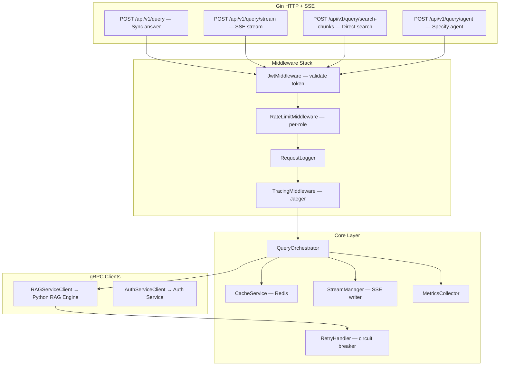
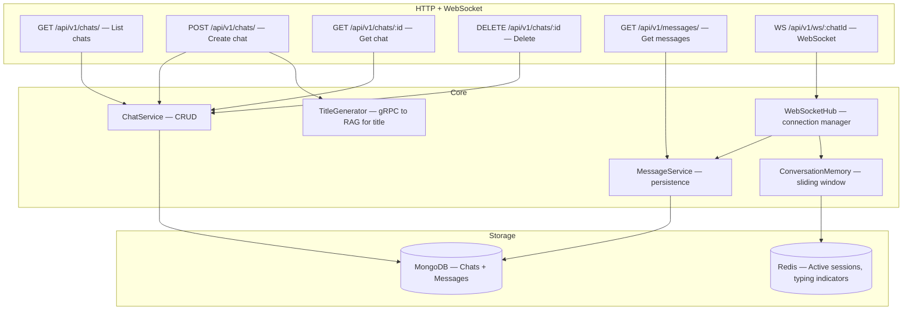
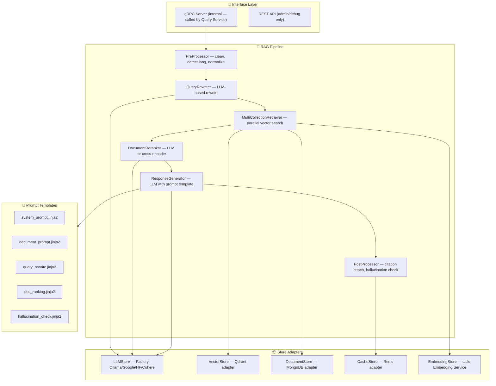
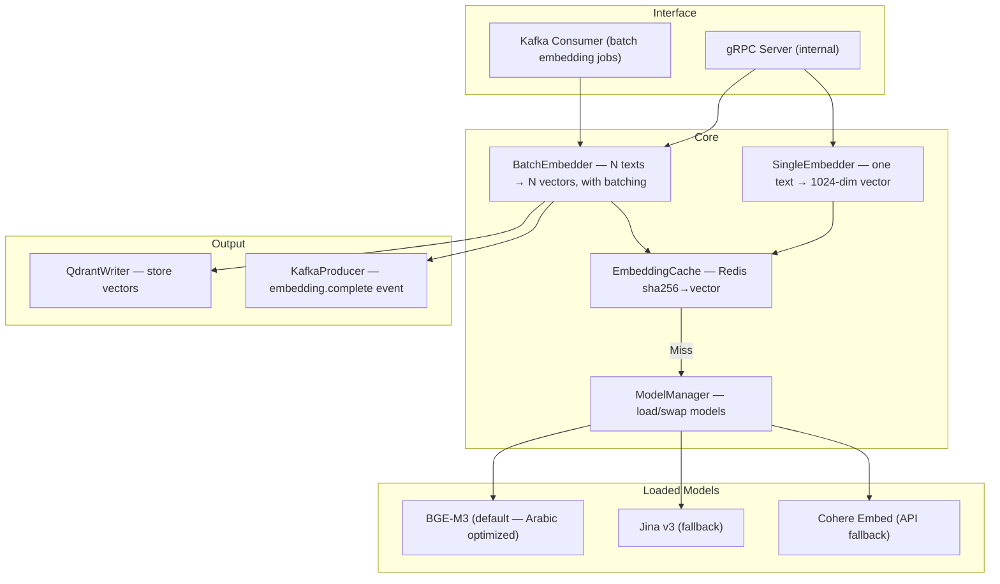
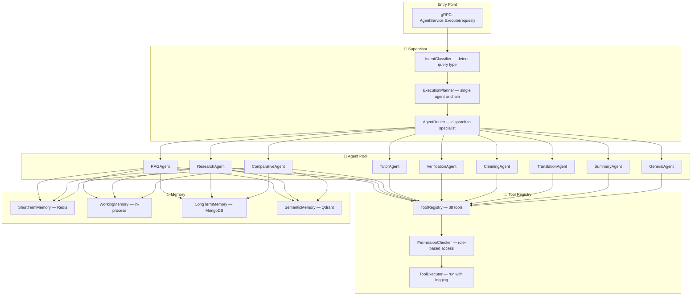
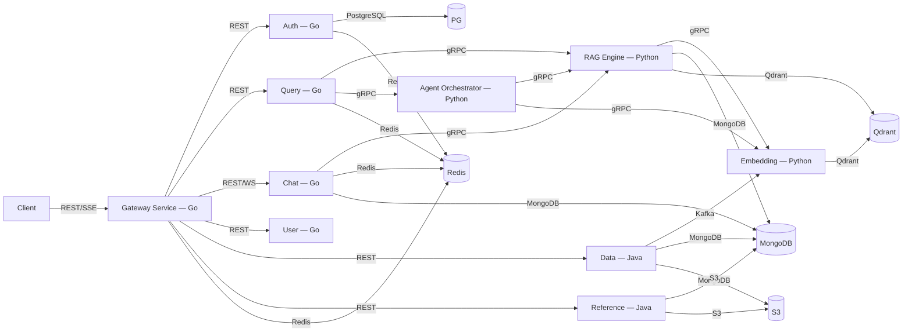

# 🕌 Mishkat Platform — Final Engineering Blueprint (Part 3B)
## Deep Service Architecture: Query · Chat · RAG Engine · Embedding · Agent Orchestrator

> **Part 3A** covers: Data Ingestion Service, Reference Service, Auth Service, User Service  
> **Part 3B** covers: Query Service, Chat Service, RAG Engine, Embedding Service, Agent Orchestrator

---

## S5. Query Service — Java (Spring WebFlux + gRPC)

### Purpose
The **orchestrator** — receives user queries from the gateway, calls the Python RAG Engine via gRPC, manages streaming, caching, and response assembly.

### Internal Architecture



### Key Components

| Component | Responsibility |
|-----------|---------------|
| `QueryOrchestrator` | Central brain: checks cache → calls RAG Engine → assembles response with citations → caches result |
| `CacheService` | Redis-backed. Exact-match cache (query hash → response, 5min TTL). Semantic cache (query embedding → similar cached response via Qdrant "query_cache" collection) |
| `StreamManager` | Manages SSE connections. Reads gRPC stream from RAG Engine, forwards token-by-token to client. Handles client disconnect gracefully. |
| `RetryHandler` | Circuit breaker pattern (go-resilience). If RAG Engine fails 3× in 60s → open circuit → return "service temporarily unavailable" for 30s. |
| `MetricsCollector` | Prometheus counters: `query_total`, `query_latency_ms`, `cache_hit_ratio`, `agent_type_distribution` |

### Query Flow (Streaming)

```
1. Client → POST /api/v1/query/stream {query, references, chat_id}
2. JwtMiddleware → validate token, extract user_id + role
3. RateLimitMiddleware → check rate (50/hr for student)
4. QueryOrchestrator:
   a. cache_key = sha256(query + references + language)
   b. Check Redis exact cache → if hit, stream cached response
   c. Check Qdrant semantic cache (similarity > 0.95) → if hit, stream
   d. If miss → build gRPC QueryRequest with agent_type
   e. Call RAGEngine.StreamQuery(request) → get stream
5. StreamManager:
   a. Open SSE connection to client
   b. For each token from gRPC stream:
      - Write "data: {token}\n\n" to client
      - Accumulate full response
   c. On stream end: cache full response in Redis + Qdrant
6. MetricsCollector → record latency, cache_hit, agent_type
```

### Directory Structure
```
query-service/
├── cmd/main.go
├── internal/
│   ├── handlers/
│   │   └── query_handler.go
│   ├── services/
│   │   ├── query_orchestrator.go
│   │   ├── cache_service.go
│   │   ├── stream_manager.go
│   │   └── metrics_collector.go
│   ├── grpc/
│   │   ├── rag_client.go          # gRPC client to Python RAG
│   │   └── retry_handler.go       # Circuit breaker
│   ├── middleware/
│   │   ├── jwt_middleware.go
│   │   ├── rate_limit_middleware.go
│   │   ├── logger_middleware.go
│   │   └── tracing_middleware.go
│   ├── models/
│   │   ├── query_request.go
│   │   └── query_response.go
│   └── config/config.go
├── go.mod
└── Dockerfile
```

---

## S6. Chat Service — Java (Spring WebSocket)

### Purpose
Real-time chat management — WebSocket connections, chat sessions, message persistence, conversation memory.

### Internal Architecture



### Key Components

| Component | Responsibility |
|-----------|---------------|
| `ChatService` | CRUD for chat sessions. Paginated listing with last-message preview. |
| `MessageService` | Store/retrieve messages. Sliding window (last 20 messages for context). Pagination for history. |
| `WebSocketHub` | Gorilla WebSocket. Manages active connections per user. Broadcasts typing indicators. Handles reconnection. |
| `TitleGenerator` | Calls RAG Engine to generate 5-word chat title from first message (replaces your current inline LLM call). |
| `ConversationMemory` | Maintains last N messages in Redis for fast retrieval. Used by RAG Engine for context-aware responses. |

### Directory Structure
```
chat-service/
├── cmd/main.go
├── internal/
│   ├── handlers/
│   │   ├── chat_handler.go
│   │   ├── message_handler.go
│   │   └── websocket_handler.go
│   ├── services/
│   │   ├── chat_service.go
│   │   ├── message_service.go
│   │   ├── websocket_hub.go
│   │   ├── title_generator.go
│   │   └── conversation_memory.go
│   ├── models/
│   │   ├── chat.go
│   │   └── message.go
│   ├── repository/
│   │   ├── chat_repo.go           # MongoDB
│   │   └── message_repo.go        # MongoDB
│   └── middleware/
│       └── auth_middleware.go
├── go.mod
└── Dockerfile
```

---

## S7. RAG Engine — Python (FastAPI + gRPC Server)

### Purpose
The AI core — your existing QueryController/VectorController/ChunkController logic, refactored into a clean service that exposes gRPC for internal communication and provides the RAG pipeline.

### Internal Architecture



### Pipeline Stages Detail

| Stage | Class | What It Does | Migrated From |
|-------|-------|-------------|---------------|
| `PreProcessor` | Cleans Arabic text, detects language, normalizes | Your `QueryController.clean()` |
| `QueryRewriter` | LLM rewrites user query for better vector search | Your `QueryController.query_rewrite()` |
| `MultiCollectionRetriever` | Searches N Qdrant collections in parallel, merges results | Your `QueryController.search_vector_db_collection()` loop |
| `DocumentReranker` | LLM ranks retrieved docs by relevance | Your `QueryController.docs_selection()` |
| `ResponseGenerator` | Builds prompt from template + context, calls LLM | Your `QueryController.prompt_construction()` + `answer_rag_question()` |
| `PostProcessor` | Attaches citations (book/chapter/number), runs hallucination check, caches | **NEW** |

### LLM Failover Chain (NEW)

```python
class LLMStore:
    """Cascading failover with circuit breakers."""
    
    providers = [
        ("google", GoogleProvider, CircuitBreaker(fail_max=3, reset_timeout=300)),
        ("ollama", OllamaProvider, CircuitBreaker(fail_max=3, reset_timeout=300)),
        ("cohere", CohereProvider, CircuitBreaker(fail_max=3, reset_timeout=300)),
        ("huggingface", HFProvider, CircuitBreaker(fail_max=3, reset_timeout=300)),
    ]
    
    async def generate(self, prompt, **kwargs):
        for name, provider, breaker in self.providers:
            if breaker.is_open:
                continue  # skip failed providers
            try:
                return await provider.generate(prompt, **kwargs)
            except Exception:
                breaker.record_failure()
        raise AllProvidersDownError()
```

### Directory Structure
```
rag-engine/
├── main.py                          # FastAPI + gRPC server startup
├── grpc_server.py                   # gRPC service implementation
├── pipeline/
│   ├── __init__.py
│   ├── preprocessor.py              # ← from QueryController.clean()
│   ├── query_rewriter.py            # ← from QueryController.query_rewrite()
│   ├── multi_retriever.py           # ← from QueryController.search_vector_db_collection()
│   ├── document_reranker.py         # ← from QueryController.docs_selection()
│   ├── response_generator.py        # ← from QueryController.prompt_construction()
│   └── post_processor.py            # NEW: citations + hallucination check
├── stores/
│   ├── llm_store.py                 # ← from stores/llm/ (with failover chain)
│   ├── vector_store.py              # ← from stores/vectorDB/
│   ├── document_store.py            # MongoDB adapter
│   ├── cache_store.py               # Redis adapter (NEW)
│   └── embedding_store.py           # gRPC client to Embedding Service
├── providers/
│   ├── ollama_provider.py           # ← existing
│   ├── google_provider.py           # ← existing
│   ├── huggingface_provider.py      # ← existing
│   └── cohere_provider.py           # ← existing
├── templates/
│   ├── system_prompt.jinja2
│   ├── document_prompt.jinja2
│   ├── query_rewrite.jinja2
│   ├── doc_ranking.jinja2
│   └── hallucination_check.jinja2
├── models/                          # ← existing Pydantic models
├── proto/
│   └── rag_service_pb2_grpc.py      # Generated from shared proto
├── requirements.txt
└── Dockerfile
```

---

## S8. Embedding Service — Python (FastAPI + gRPC)

### Purpose
Dedicated model inference service for text embedding. Decoupled from RAG Engine for independent scaling (GPU autoscaling).

### Internal Architecture



### Key Components

| Component | Details |
|-----------|---------|
| `SingleEmbedder` | Embed one text. Checks Redis cache first (`emb:sha256(text)` → vector). If miss, calls model. |
| `BatchEmbedder` | Embed N texts in configurable batch sizes (default 100). Used by ingestion pipeline via Kafka. |
| `EmbeddingCache` | Redis: `emb:{sha256}` → compressed float32 array. TTL 30 days. **Eliminates ~40% redundant calls.** |
| `ModelManager` | Hot-swap models without restart. Primary: BGE-M3 (local). Fallback: Jina v3, Cohere API. |

### Directory Structure
```
embedding-service/
├── main.py
├── grpc_server.py
├── kafka_consumer.py
├── core/
│   ├── single_embedder.py
│   ├── batch_embedder.py
│   ├── embedding_cache.py
│   └── model_manager.py
├── models/
│   ├── bge_m3_model.py
│   ├── jina_model.py
│   └── cohere_model.py
├── output/
│   ├── qdrant_writer.py
│   └── kafka_producer.py
├── proto/
│   └── embedding_service_pb2_grpc.py
├── requirements.txt
└── Dockerfile
```

---

## S9. Agent Orchestrator — Python (LangGraph)

### Purpose
The multi-agent system — Supervisor routing, 9 specialist agents, tool registry, memory management.

### Internal Architecture



### Supervisor Decision Flow

```python
class Supervisor:
    async def route(self, query: str, user_role: str, chat_history: list):
        # Step 1: Classify intent
        intent = self.intent_classifier.classify(query)
        # Returns: {type: "research", confidence: 0.92, entities: [...]}
        
        # Step 2: Plan execution
        plan = self.planner.plan(intent, user_role)
        # Returns: ExecutionPlan with steps:
        # [
        #   {agent: "research", parallel: False},
        #   {agent: "verification", parallel: True},  # runs alongside research
        #   {agent: "translation", parallel: False, depends_on: ["research", "verification"]}
        # ]
        
        # Step 3: Execute plan via LangGraph state machine
        result = await self.execute_plan(plan)
        return result
```

### Agent Base Class

```python
class BaseAgent(ABC):
    def __init__(self, tool_registry: ToolRegistry, memory: MemoryManager):
        self.tools = tool_registry
        self.memory = memory
        self.allowed_tools: list[str] = []  # Override per agent
    
    @abstractmethod
    async def execute(self, query: str, context: AgentContext) -> AgentResponse:
        """Each agent implements its own logic using self.tools."""
        pass
    
    async def use_tool(self, tool_name: str, **kwargs) -> ToolResult:
        """Call a tool from the registry with permission check + logging."""
        return await self.tools.execute(tool_name, self.context.user_role, **kwargs)
```

### Tool Registry Implementation

```python
class ToolRegistry:
    def __init__(self):
        self._tools: dict[str, BaseTool] = {}
        self._permissions: dict[str, list[str]] = {}  # tool → allowed roles
    
    def register(self, tool: BaseTool, allowed_roles: list[str]):
        self._tools[tool.name] = tool
        self._permissions[tool.name] = allowed_roles
    
    async def execute(self, name: str, user_role: str, **kwargs) -> ToolResult:
        if user_role not in self._permissions[name]:
            raise PermissionDenied(f"Role '{user_role}' cannot use '{name}'")
        
        tool = self._tools[name]
        start = time.time()
        result = await tool.run(**kwargs)
        latency = time.time() - start
        
        # Audit log
        await self.audit_logger.log(tool=name, role=user_role, latency=latency)
        return result
```

### Directory Structure
```
agent-orchestrator/
├── main.py                           # gRPC server for agent execution
├── supervisor/
│   ├── __init__.py
│   ├── supervisor.py                 # Main supervisor agent
│   ├── intent_classifier.py          # Detect query type
│   ├── execution_planner.py          # Plan agent chains
│   └── agent_router.py               # Dispatch to specialist
├── agents/
│   ├── base_agent.py                 # Abstract base class
│   ├── rag_agent.py                  # Enhanced RAG
│   ├── research_agent.py             # Multi-source research
│   ├── comparative_agent.py          # Madhab comparison
│   ├── tutor_agent.py                # Adaptive learning
│   ├── verification_agent.py         # Isnad analysis
│   ├── cleaning_agent.py             # Data cleaning
│   ├── translation_agent.py          # Multi-language
│   ├── summary_agent.py              # Summarization
│   └── general_agent.py              # Fallback
├── tools/
│   ├── registry.py                   # Central tool registry
│   ├── base_tool.py                  # Abstract tool base
│   ├── search/
│   │   ├── vector_search_tool.py
│   │   ├── keyword_search_tool.py
│   │   ├── web_search_tool.py
│   │   ├── web_scrape_tool.py
│   │   ├── quran_search_tool.py
│   │   ├── tafsir_lookup_tool.py
│   │   ├── hadith_by_number_tool.py
│   │   ├── cross_reference_tool.py
│   │   ├── narrator_search_tool.py
│   │   └── fatwa_search_tool.py
│   ├── text/
│   │   ├── arabic_clean_tool.py
│   │   ├── arabic_diacritize_tool.py
│   │   ├── transliterate_tool.py
│   │   ├── translate_tool.py
│   │   ├── summarize_tool.py
│   │   ├── extract_keywords_tool.py
│   │   ├── detect_language_tool.py
│   │   ├── chunk_text_tool.py
│   │   ├── parse_pdf_tool.py
│   │   └── parse_html_tool.py
│   ├── analysis/
│   │   ├── verify_isnad_tool.py
│   │   ├── grade_hadith_tool.py
│   │   ├── compare_narrations_tool.py
│   │   ├── topic_classify_tool.py
│   │   ├── sentiment_analyze_tool.py
│   │   └── hallucination_check_tool.py
│   ├── storage/
│   │   ├── cache_get_tool.py
│   │   ├── cache_set_tool.py
│   │   ├── save_research_tool.py
│   │   ├── get_chat_history_tool.py
│   │   ├── log_interaction_tool.py
│   │   ├── embed_text_tool.py
│   │   └── store_vector_tool.py
│   └── external/
│       ├── islamqa_tool.py
│       ├── sunnah_api_tool.py
│       ├── quran_api_tool.py
│       ├── prayer_times_tool.py
│       └── hijri_calendar_tool.py
├── memory/
│   ├── memory_manager.py
│   ├── short_term_memory.py          # Redis
│   ├── working_memory.py             # In-process
│   ├── long_term_memory.py           # MongoDB
│   └── semantic_memory.py            # Qdrant
├── proto/
│   └── agent_service_pb2_grpc.py
├── requirements.txt
└── Dockerfile
```

---

## Inter-Service Communication Map



| From → To | Protocol | Purpose |
|-----------|----------|---------|
| Client → Gateway Service | REST + SSE + WS | All external traffic, JWT validated at gateway |
| Gateway → Auth | REST | Token refresh, OAuth flows |
| Gateway → Query | REST | User queries (JWT already validated by gateway middleware) |
| Gateway → Chat | REST + WebSocket | Chat management + real-time |
| Query → RAG Engine | **gRPC** (streaming) | Execute RAG pipeline |
| Query → Agent Orchestrator | **gRPC** | Route to specialist agents |
| Agent → RAG Engine | **gRPC** | Agents use RAG as a sub-component |
| Agent → Embedding | **gRPC** | On-demand embedding |
| Data Ingestion → Embedding | **Kafka** | Async batch embedding jobs |
| Chat → RAG Engine | **gRPC** | Title generation |
| All services → Redis | TCP | Caching, sessions, rate limiting |
| All services → MongoDB | TCP | Document storage |
| RAG + Embedding → Qdrant | HTTP/gRPC | Vector operations |
